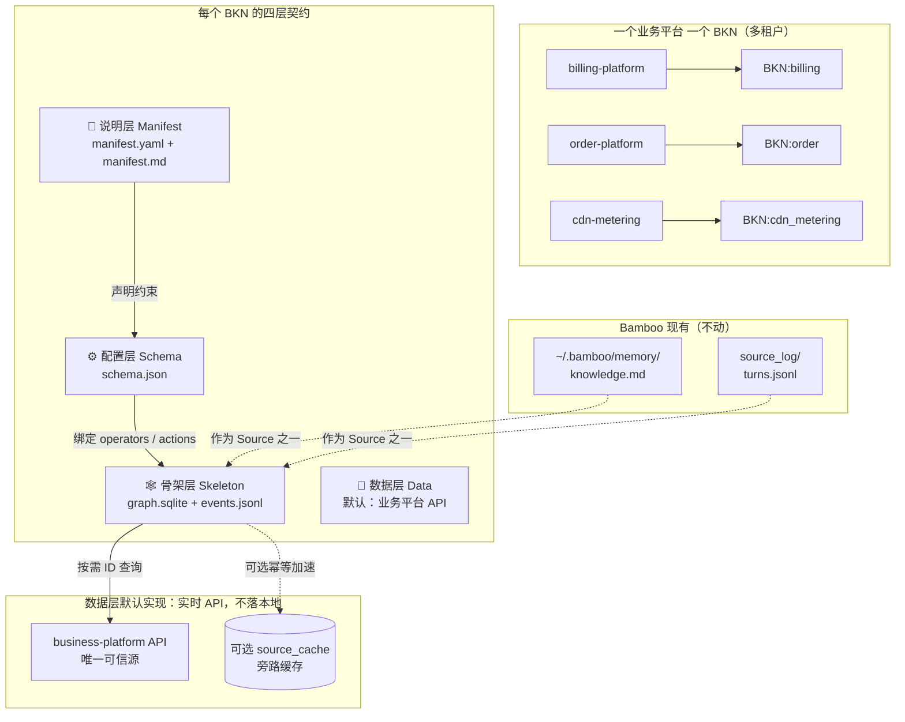
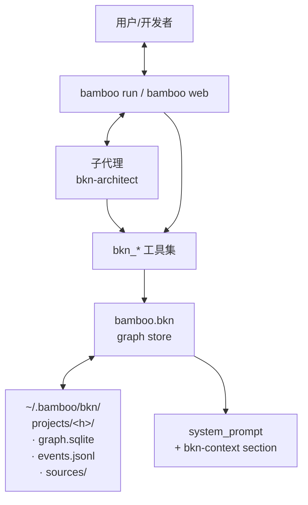
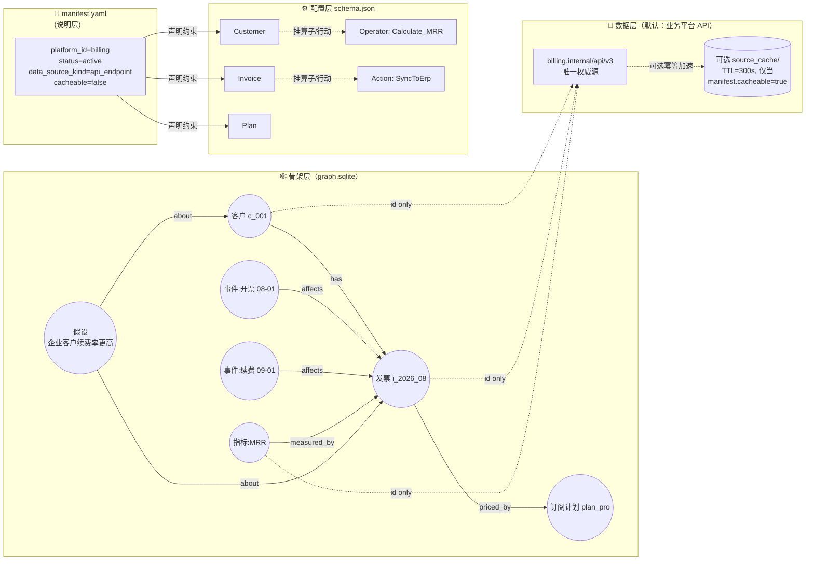
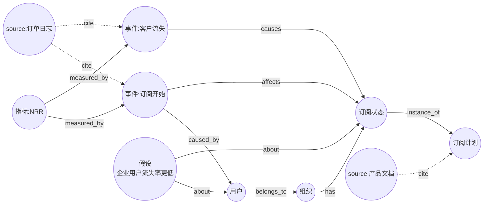
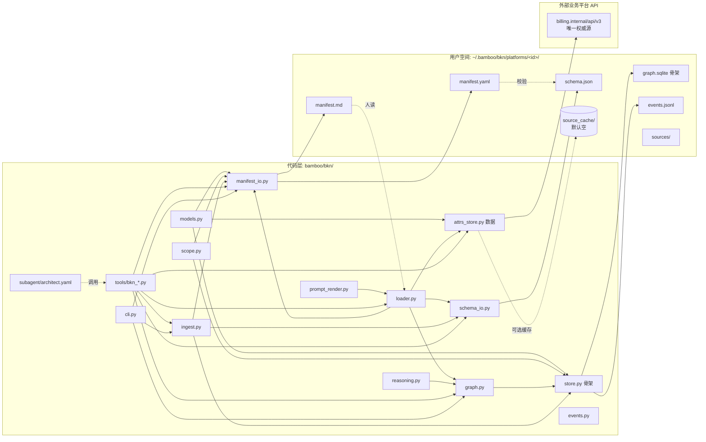
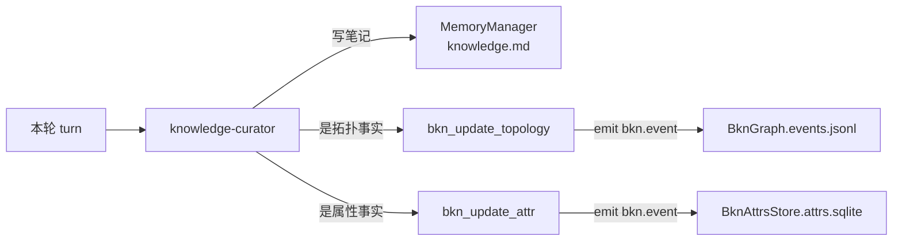
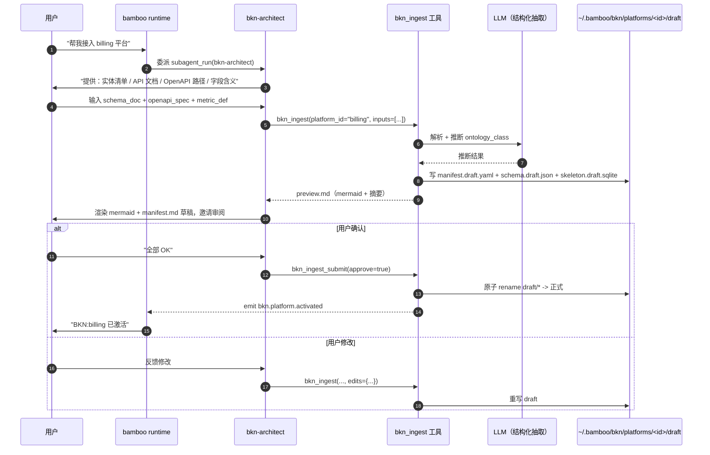

# BKN（业务数据知识网络）设计方案

> 目标：在 Bamboo 之上引入一层 **业务数据知识网络（Business Knowledge Network）**，让 Bamboo
> 能与用户协作分析数据、迭代式地构建出可推理的业务知识网络，并在每次会话中作为结构化上下文生效。
>
> 本文档与 `docs/bkn-design.md`（平台数据对接）相互独立但互补：那份负责"接哪条数据管道"，
> 这份负责"沉淀出什么样的业务世界模型"。

---

## 1. 概念：什么是 BKN

BKN 不是把数据塞进 LLM 的 context，也不是文档 + embedding 的 RAG。它是一种 **结构化的业务世界模型**。

### 1.1 一个 BKN 对应一个业务平台（多租户）

现实企业里往往存在多个业务平台（计费平台、客服平台、订单平台、CDN 计量平台……），
每个平台有自己的实体、关系、行为约束。BKN 不是一个项目一张图，而是 **一个业务平台一个 BKN**。
这一约束不可妥协，因为它直接决定数据来源、知识边界和写入权限。

```
billing-platform      ──→  BKN: billing         (独立 manifest + skeleton + schema)
order-platform        ──→  BKN: order           (独立 manifest + skeleton + schema)
cdn-metering-platform ──→  BKN: cdn_metering    (独立 manifest + skeleton + schema)
support-platform      ──→  BKN: support         (独立 manifest + skeleton + schema)
```

BKN 与 Bamboo 现有 `~/.bamboo/memory/projects/<hash>/knowledge/*.md` 的根本差别：

- `knowledge.md` 是 **自然语言笔记**，碎片、可读、适合塞进 prompt
- BKN 是 **结构化业务世界模型**，可查询、可推理、可视化、可版本化，且与"业务平台"显式对齐

### 1.2 BKN 的四层契约

参考 KWeaver 的"图管关系、库管数据、配置管行为"，并加上 **说明层**：

| 层                        | 责任                                                                          |
|---------------------------|-------------------------------------------------------------------------------|
| 📜 **说明层 (Manifest)**  | 「这是谁、什么状态、谁拥有、约束是什么」 — `manifest.yaml` + `manifest.md`     |
| 🕸 **骨架层 (Skeleton)**  | 谁和谁有关系 — `graph.sqlite` + `events.jsonl`（append-only 拓扑操作审计）     |
| ⚙️ **配置层 (Schema)**    | ontology class 上挂哪些算子、哪些行动 — `schema.json`                          |
| 📡 **数据层 (Data)**      | 节点属性去哪查 — **默认是业务平台 API**（不写本地！）；可选 SQLite/file 作旁路缓存 |

数据层关键：**默认不落本地**。这是从 KWeaver "图谱与数据持久化解耦" 演进而来——业务平台自己
就有最权威的数据源，BKN 不重复拷贝；只装载时按需调用。

| 概念                   | 含义                                                                  |
|------------------------|-----------------------------------------------------------------------|
| **Entities / Concepts**| 业务中的真实对象、抽象概念（用户、订单、产品、订阅状态、风险等级……） |
| **Relations**          | 实体/概念之间的关系：`has`、`belongs_to`、`occurs_in`、`caused_by`、`measured_by` |
| **Events**             | 业务中发生的事（用户付费、订单取消、设备故障），可追踪、可归因          |
| **Metrics**            | 指标（NRR、MTTR、转化率），绑定到实体或事件，可追溯计算口径              |
| **Hypotheses**         | 当前正在求证的业务假设，带证据链                                        |
| **Sources**            | 每一段断言的出处：平台 API 响应、文档片段、对话片段、agent 推理          |
| **Operators**          | 绑定在 ontology class 上的可调用逻辑                                    |
| **Actions**            | 绑定在 ontology class 上的可执行工具                                    |

### 1.3 BKN 是 **自下而上构建**，不是从对话沉淀

BKN 不通过读取历史会话自动生成。它的来源是：

1. **用户主动接入新平台** → 用户输入实体清单 / API 文档 / 字段语义 / 用户口述
2. **Agent `bkn_ingest` 解析 + LLM 抽取** → 草稿区
3. **用户审阅 + approve** → 正式区（写入 skeleton / schema / manifest）

对话本身只作为 Sources / Hypotheses 的证据之一，**不作为骨架的主输入**。这一点和 Bamboo 现有
`KnowledgeSubagent`（在 turn 结束后被动沉淀）形成互补不替代。



---

## 2. 与 Bamboo 现有架构的边界

### 2.1 复用而非重写

| 已有组件                                 | 在 BKN 中的角色                                                       |
|------------------------------------------|-----------------------------------------------------------------------|
| `Context.project_root / memory_dir`      | 派生出 `bkn_dir`，复用 `get_memory_dir_name` 做 per-project 隔离      |
| `MemoryScope`（chat / project）          | BKN 也支持 per-project + chat-global 两级 scope，但走自己的目录       |
| `SourceLogMatch` & `search_source_logs`  | BKN 把历史会话当成 entity / event 的证据源之一，可继续走 source_log    |
| `EventBus`                               | BKN 改图时通过 `bkn.node.added` / `bkn.hypothesis.updated` 等事件暴露 |
| `SubagentDefinition`（buildin）          | 新增 `bkn-architect` 子代理，专门和用户对话构建图谱                    |
| `KnowledgeSubagent` / knowledge_curator  | 知识沉淀链路的下游：在 turn 结束后生成 BKN 更新提议，不直接改 md       |
| `PromptSection`                          | bkn 一份可序列化快照注入到 `system_prompt`，作为 `bkn-context` 节     |
| `Cron` heartbeat / `Workflow`            | 周期性把 `~/.bamboo/memory/projects/<h>/` 里的 md 反向萃取进 BKN      |

### 2.2 不动什么

- ✅ 不改 `MemoryManager` 的 append / replace / remove_matching 行为
- ✅ 不动 `bamboo/prompts/system_prompt.py` 的 section 顺序，只加一个 section
- ✅ 不动 `Context` 必填字段，只增加可选字段
- ✅ 不内嵌向量数据库；初始版本用 SQLite + 文件 JSONL 即可

### 2.3 四层契约 + 多平台独立性（核心约束）

BKN 在写入、装载和演化时必须遵守以下五条不可打破的规则：

**R1 一个 BKN 对应一个业务平台。** 不在两个平台之间共享节点或边；跨平台协作通过
显式的 `cross_platform_edge`（带 source/target platform_id）表达。

**R2 四层各司其职。** 说明 / 骨架 / 配置 / 数据 不允许越层修改：

| 层           | 责任                          | 存储介质                                  | 写入工具                          |
|--------------|-------------------------------|-------------------------------------------|-----------------------------------|
| 📜 说明层     | 这个 BKN 是谁、状态、约束     | `manifest.yaml` + `manifest.md`            | `bkn_manifest_update`            |
| 🕸 骨架层     | 谁和谁有关系                  | `graph.sqlite` + `events.jsonl`            | `bkn_update_topology` / `bkn_link_source` |
| ⚙️ 配置层     | 哪些算子/行动可作用于哪些类   | `schema.json`                             | `bkn_schema_update`（用户主导）     |
| 📡 数据层     | 每个节点的具体属性是什么      | **业务平台 API（默认不落本地）**；可选 source_cache | 不写入；只在装载时拉取         |

**R3 强一致性不在图上做。** 节点属性变化（如"订单状态变了"）只由上游业务平台掌握，
BKN 永远不复制状态；Context Loader 每次实时反查。
**拓扑变化**才动 `events.jsonl`。

**R4 数据层默认不落本地。** `BknAttrsStore` 唯一职责是**调用平台 API**；只有在
`manifest.cacheable=true` 时才把响应写进 `source_cache/`，并由 `cache_ttl_seconds`
和 `cache_strategy`（etag / last_modified / ttl）共同决定可复用性。

**R5 说明层是入口而不是文档。** `manifest.yaml` 必须包含 `platform_id / domain /
owners / data_source_kind / cacheable / operator_allowlist / action_allowlist`，
任何 agent 操作都会先校验 manifest 的 allowlist 才能执行算子/行动。

### 2.4 多平台独立性原则

| 场景                                 | 行为                                                                |
|--------------------------------------|---------------------------------------------------------------------|
| 用户在 A 平台对话中提及 B 平台的实体 | Agent 必须先 `bkn_platform_switch(platform_id=B)` 再继续             |
| 跨平台关系                            | 只允许显式 `cross_platform_edge`（携带 `from_platform / to_platform`）|
| 写跨平台节点                          | 必须有 source_platform 字段，且 allowlist 需要显式放开               |
| 同一会话多平台                        | `Context.active_platform_id` 字段记录当前对话的 active BKN          |



---

## 3. 数据模型

### 3.0 BknScope：一级维度是 platform_id

```python
@dataclass(frozen=True, slots=True)
class BknScope:
    """
    BKN 命名空间。
    一级维度: platform_id（一个业务平台一个 BKN）
    二级维度: project_hash（可选；指当前对话工作区挂载到哪个平台）
    """

    platform_id: str                # e.g. "billing" / "cdn_metering"
    project_hash: str = ""          # 可选：把当前 Bamboo 项目会话绑到这个 BKN
    env: Literal["dev", "staging", "prod"] = "prod"

    @property
    def root(self) -> Path:
        # ~/.bamboo/bkn/platforms/<platform_id>/
        ...
```

### 3.1 节点类型

```python
class NodeKind(str, Enum):
    entity       # 真实对象
    concept      # 抽象业务概念
    event        # 已发生的事
    metric       # 指标
    hypothesis   # 业务假设
    source       # 出处节点（平台 API 响应、文档片段、对话片段、agent 推理）
```

### 3.2 节点结构（骨架层，不再持有"重数据"）

```python
@dataclass(frozen=True, slots=True)
class BknNodeId:           # ULID 形式的 id
    value: str

@dataclass(frozen=True, slots=True)
class BknNode:
    """图谱骨架节点：只承载稳定元信息与大指针，不承载长文本/凭据/热数据。"""

    id: BknNodeId
    platform_id: str                # 冗余存储，便于多平台查询时无需 join scope
    kind: NodeKind
    ontology_class: str             # 引自 schema.json 的类名（Content / Tag / Platform ...）
    name: str                       # canonical name
    aliases: tuple[str, ...]        # 同义别名
    description: str                # 短描述，可入 prompt
    static_attrs: Mapping[str, str] # 仅放稳定元属性；其余 attrs 走数据层
    data_source: BknDataSourceRef | None   # 默认走 api_endpoint
    evidence_ids: tuple[BknNodeId, ...]
    confidence: float
    created_at: datetime
    updated_at: datetime
    version: int = 1

@dataclass(frozen=True, slots=True)
class BknDataSourceRef:
    """节点 → 数据层的指针（KWeaver 风格的"数据虚拟化引用"）。"""

    kind: Literal["api_endpoint", "sqlite_row", "file_path"] = "api_endpoint"
    location: str                # 默认 https://billing.internal/api/v3/invoices/{id}
    field_mapping: Mapping[str, str] = field(default_factory=dict)
    cacheable: bool = False      # 默认不缓存；白名单 manifest 才允许开 cache
    cache_key: str | None = None # 显式缓存键（默认 = id）
```

### 3.3 关系

```python
@dataclass(frozen=True, slots=True)
class BknEdge:
    id: BknEdgeId
    src: BknNodeId
    dst: BknNodeId
    relation: str          # has / belongs_to / occurs_in / caused_by / measured_by ...
    weight: float = 1.0    # 解释力权重，可用于推理排序
    evidence_ids: tuple[BknNodeId, ...] = ()
    created_at: datetime
```

### 3.4 事件 / 假设 / 来源

```python
@dataclass(frozen=True, slots=True)
class BknEvent(BknNode):     # kind == "event"
    occurred_at: datetime
    payload_ref: BknDataSourceRef | None = None   # 事件载荷也走数据层

@dataclass(frozen=True, slots=True)
class BknHypothesis(BknNode):  # kind == "hypothesis"
    status: Literal["open", "supported", "weakened", "refuted"]
    supporting: tuple[BknNodeId, ...] = ()
    contradicting: tuple[BknNodeId, ...] = ()

@dataclass(frozen=True, slots=True)
class BknSource(BknNode):     # kind == "source"
    location: str              # session://.../turn... 或 file://... 或 url://...
    excerpt: str
```

### 3.5 说明层 Manifest：BknManifest

```python
@dataclass(frozen=True, slots=True)
class BknManifest:
    """
    一个 BKN 的"身份证"。
    所有 agent 操作都必须先校验 manifest.allowlist / cacheable / status 字段。
    """

    # ── 身份 ───────────────────────────────────────────────────────────
    platform_id: str                        # e.g. "billing"
    name: str                               # e.g. "CDN 计费平台"
    domain: str                             # e.g. "billing-and-subscription"
    owners: tuple[str, ...]                 # e.g. ("@liubaoyang", "team-billing")
    created_at: datetime
    updated_at: datetime
    version: int = 1

    # ── 状态 ───────────────────────────────────────────────────────────
    status: Literal["draft", "active", "paused", "deprecated"] = "draft"
    description: str = ""                   # 长描述，可入 prompt

    # ── 数据源声明（决定数据层如何反查）─────────────────────────────
    data_source_kind: Literal["api_endpoint", "sqlite_row", "file_path"] = "api_endpoint"
    base_url: str = ""                      # 数据 API base
    auth_ref: str = ""                      # e.g. "vault://billing/api-token" 或本地路径

    # ── 缓存策略（默认禁用）────────────────────────────────────────
    cacheable: bool = False
    cache_strategy: Literal["etag", "last_modified", "ttl"] = "ttl"
    cache_ttl_seconds: int = 300

    # ── 安全与允许列表（agent 写入前必须校验）───────────────────────
    operator_allowlist: tuple[str, ...] = ()
    action_allowlist: tuple[str, ...] = ()
    cross_platform_edges_allowed: bool = False  # 默认不允许跨平台

    # ── 关联 ──────────────────────────────────────────────────────────
    source_provenance: tuple[BknNodeId, ...] = ()   # 提供初稿的那些 Sources

    def is_writeable(self) -> bool:
        return self.status in {"draft", "active"}
```

`manifest.yaml` 示例：

```yaml
platform_id: billing
name: CDN 计费平台
domain: billing-and-subscription
owners:
  - "@liubaoyang"
status: draft            # ⭐ agent 只在 draft/active 可写骨架
data_source_kind: api_endpoint
base_url: https://billing.internal/api/v3
auth_ref: vault://billing/api-token
cacheable: false         # ⭐ 默认不落本地
operator_allowlist:
  - bamboo.bkn.operators.billing.mrr
action_allowlist:
  - bkn_action_sync_invoice
cross_platform_edges_allowed: false
```

### 3.6 算子（Operator）与行动（Action）

```python
@dataclass(frozen=True, slots=True)
class OperatorSpec:
    """绑定在 ontology_class 上的可调用逻辑（KWeaver 维度 2：动态属性 → 算子）。"""

    name: str                          # e.g. "Calculate_Engagement_Rate"
    description: str
    entry: str                         # 白名单 python 入口：bamboo.bkn.operators.engagement_rate
    inputs: Mapping[str, str]          # 输入属性名 → 类型
    outputs: Mapping[str, str]         # 输出衍生属性名 → 类型
    timeout_seconds: float = 5.0

@dataclass(frozen=True, slots=True)
class ActionSpec:
    """绑定在 ontology_class 上的可执行工具（KWeaver 维度 3：API/工具）。"""

    name: str                          # e.g. "SyncToPlatform"
    description: str
    tool: str                          # 注册表里的工具名，例如 "bkn_action_sync"
    bindings: tuple[str, ...] = ()     # 挂在哪些 ontology_class 上
    param_schema: Mapping[str, object] = field(default_factory=dict)
    post_hooks: tuple[BknPostHook, ...] = ()   # 行动执行后异步写图
```

### 3.7 本体配置 schema.json 示例（数据层之外、决定行为）

```json
{
  "platform_id": "billing",
  "version": 1,
  "classes": {
    "Invoice": {
      "static_attrs": ["invoice_no", "currency"],
      "data_source": { "kind": "api_endpoint", "location": "/invoices/{id}" },
      "operators": ["Calculate_MRR"],
      "actions": ["SyncToErp"]
    },
    "Customer": {
      "static_attrs": ["customer_no", "plan_code"],
      "data_source": { "kind": "api_endpoint", "location": "/customers/{id}" },
      "operators": [],
      "actions": []
    },
    "AssetMetrics": {
      "static_attrs": ["viewCount", "likeCount"],
      "data_source": { "kind": "api_endpoint", "location": "/metrics/{id}" },
      "operators": ["Calculate_Engagement_Rate"],
      "actions": []
    }
  },
  "operator_registry": {
    "Calculate_MRR":                "bamboo.bkn.operators.billing.mrr",
    "Calculate_Engagement_Rate":    "bamboo.bkn.operators.engagement.rate"
  },
  "action_registry": {
    "SyncToErp":   { "tool": "bkn_action_sync_erp" }
  }
}
```

注意：`schema.json` 现在必须声明 `platform_id`，与 `manifest.platform_id` 一致；
agent 在写入前会校验两者匹配，防止误把 A 平台的 schema 写到 B 平台。

### 3.8 实体图示例（按"计费平台"画一个最小子图）





---

## 4. 目录与文件结构

```
bamboo/bkn/                          # 新模块
├── __init__.py
├── models.py                        # 节点 / 边 / Operator / Action / **BknManifest** / BknScope
├── scope.py                         # BknScope(platform_id)
├── store.py                         # 骨架 SQLite + events.jsonl
├── graph.py                         # 骨架层 CRUD / 邻居 / 路径
├── attrs_store.py                   # 数据层 adapter 路由（默认 HttpApiAdapter）
├── loader.py                        # BknLoader = Context Loader 引擎
├── reasoning.py                     # 路径 / 子图 / 冲突
├── ingest.py                        # bkn_ingest 流水线（拟稿区 + approve 门）
├── manifest_io.py                   # manifest.yaml / manifest.md 读写
├── operators/                       # 算子注册（白名单）
├── actions/                         # 行动实现（bkn_action_*）
├── prompt_render.py                 # BknSnapshot → PromptSection
├── events.py                        # EventBus 事件类型
├── schema_io.py                     # schema.json 读写 / 与 manifest 一致性校验
├── subagent/
│   └── architect.yaml
├── tools/                           # bkn_* 工具
│   ├── bkn_query.py
│   ├── bkn_load_context.py
│   ├── bkn_update_topology.py
│   ├── bkn_update_attr.py
│   ├── bkn_update_manifest.py
│   ├── bkn_ingest.py
│   ├── bkn_platform_switch.py
│   ├── bkn_propose.py
│   ├── bkn_link_source.py
│   ├── bkn_run_operator.py
│   ├── bkn_list_actions.py
│   ├── bkn_explain.py
│   └── bkn_export.py
└── cli.py                           # bamboo bkn 子命令

~/.bamboo/bkn/                       # 用户空间：按业务平台划分
├── global/
│   └── concepts.json                # 跨平台共享的概念字典（可选）
└── platforms/
    └── <platform_id>/               # ⭐ 一级维度：每个业务平台一个目录
        ├── manifest.yaml            # 📜 说明层（结构化）
        ├── manifest.md              # 📜 说明层（人类叙事）
        ├── graph.sqlite             # 🕸 骨架层
        ├── events.jsonl             # 🕸 拓扑操作审计
        ├── schema.json              # ⚙️ 配置层
        ├── sources/                 # Sources 节点引用的文档 / 会话片段
        └── source_cache/            # 📡 数据层（默认空；manifest.cacheable=true 才用）
            └── cache.sqlite
```

附：`~/.bamboo/bkn/projects/<project_hash>/workspace.bkn` 是一个软链或标记文件，
指向当前 Bamboo 会话 active 的 platform_id；让"项目→平台"解耦不破坏 Bamboo 现有
`Context.project_root` 模型。



---

## 5. 核心 API

### 5.1 graph.py（骨架层接口——只动 ID 与拓扑）

```python
class BknGraph:
    def __init__(self, scope: BknScope): ...

    # ── 写入：拓扑变更，永远不改数据层 ────────────────────────────────
    def upsert_node(self, node: BknNode) -> BknNode: ...
    def upsert_edge(self, edge: BknEdge) -> BknEdge: ...

    # ── 查询：只读，返回 frozen dataclass；结果仅含骨架属性 ─────────────
    def get_node(self, node_id: BknNodeId) -> BknNode | None: ...
    def find_nodes(self, *, name: str | None = None,
                   kind: NodeKind | None = None,
                   ontology_class: str | None = None,
                   alias: str | None = None) -> list[BknNode]: ...
    def neighborhood(self, node_id: BknNodeId,
                     *, depth: int = 1,
                     ontology_class: str | None = None) -> BknSubgraph: ...
    def path(self, src: BknNodeId, dst: BknNodeId,
             *, max_depth: int = 4) -> list[BknEdge]: ...
    def search_by_text(self, query: str, *, limit: int = 10) -> list[BknNode]: ...
```

### 5.2 attrs_store.py + loader.py（数据层 + Context Loader）

```python
class BknAttrsStore:
    """
    节点 → 数据层的访问入口。
    默认行为：调用业务平台 API（不写本地），通过 BknDataSourceAdapter 路由。
    """

    def __init__(self, *, manifest: BknManifest, adapters: BknAdapterRegistry): ...

    def get_attrs(self, node: BknNode, *, keys: tuple[str, ...] | None = None) -> BknAttrFetch: ...
    # BknAttrFetch = { values: Mapping[str, object], source: str, fetched_at: datetime,
    #                  cache_hit: bool, warnings: tuple[str, ...] }

class BknDataSourceAdapter(Protocol):
    """数据层三 adapter。默认实现顺序：api_endpoint → (可选) cache → sqlite_row → file_path"""

    kind: str
    def fetch(self, ref: BknDataSourceRef, *, keys: tuple[str, ...]) -> Mapping[str, object]: ...

class HttpApiAdapter:
    """默认实现：HTTPS 调用 manifest.base_url 支持的端点。"""

    kind: str = "api_endpoint"

    def __init__(self, *, base_url: str, auth_provider: AuthProvider,
                 timeout: float = 5.0, retries: int = 2): ...
    def fetch(self, ref, *, keys): ...

class BknCacheAdapter:
    """可选 source_cache/。只在 manifest.cacheable=true 时启用。"""

    def __init__(self, *, inner: BknDataSourceAdapter,
                 ttl_seconds: int, strategy: str = "ttl"): ...

class BknLoader:
    """Context Loader：focus → 装配好的 BknSnapshot。"""

    def __init__(self, graph: BknGraph, attrs: BknAttrsStore,
                 schema: BknSchema, manifest: BknManifest): ...

    def load(self, *, focus: tuple[BknNodeId, ...],
             depth: int = 1,
             include_attrs: bool = True,
             run_operators: tuple[str, ...] = (),
             available_actions: tuple[str, ...] = (),
             max_nodes: int = 80) -> BknSnapshot: ...
```

`BknSnapshot` schema（agent 看到的东西）：

```yaml
platform_id: billing
manifest_status: active            # ⭐ 当 manifest.paused/deprecated 时标红
skeleton:                          # 拓扑骨架
  - (c_001)-[HAS]->(i_2026_08)
static_attrs:                      # 数据层实时反查
  c_001: { name: "...", plan: "pro", fetched_at: "...", source: "billing.internal/api/v3" }
operator_outputs:                  # 算子结果
  i_2026_08: { mrr_contribution: "7200.00" }
available_actions:                 # 受 manifest.action_allowlist 约束
  - { name: SyncToErp, tool: bkn_action_sync_erp }
open_hypotheses:
  - "企业客户续费率更高 (status=open, +3 -1)"
attrs_unavailable: []              # 数据 API 失败的节点 ID 列表
```

### 5.3 tools 包（agent 可调用）

| 工具                    | 作用                                                                        |
|-------------------------|-----------------------------------------------------------------------------|
| `bkn_query`             | 仅骨架查询：邻居 / 路径 / 全文检索（不拉数据层）                            |
| `bkn_load_context`      | Context Loader 入口；返回装配好的 `BknSnapshot`                             |
| `bkn_update_topology`   | 改骨架专用（节点 / 边），要求带 evidence                                    |
| `bkn_update_attr`       | **通常禁用**；manifest.cacheable=true 时才允许写 source_cache               |
| `bkn_update_manifest`   | 更新 manifest.yaml 字段（status / allowlist / description）                  |
| `bkn_ingest`            | **构建入口**：用户输入实体清单 / API 文档 / 字段语义 → 拟稿 → 用户审阅 → 提交 |
| `bkn_platform_switch`   | 切换当前会话 active BKN（跨平台协作时必用）                                 |
| `bkn_propose`           | 提交假设，写入 `Hypothesis(status=open)`                                    |
| `bkn_link_source`       | 把 source_log 的某条记录 attach 到现有节点                                  |
| `bkn_run_operator`      | 触发 manifest.operator_allowlist 中的算子                                   |
| `bkn_list_actions`      | 列举当前 BKN 允许的行动                                                     |
| `bkn_explain`           | 给定节点生成自然语言解释，写入 source                                       |
| `bkn_export`            | 导出 mermaid / dot / md                                                     |

### 5.4 `bkn_ingest` 详细规范

**目的**：用户在 Bamboo 会话中主动接入新业务平台，agent 据此构建该 BKN 的所有四层。

**输入**（每次调用至少给出 platform_id）：

```yaml
bkn_ingest:
  platform_id: billing
  manifest_draft:
    name: "CDN 计费平台"
    domain: "billing-and-subscription"
    owners: ["@liubaoyang"]
  inputs:
    - kind: schema_doc
      title: "实体清单"
      content: |
        Entity: Invoice
          fields: id (UUID), amount (Decimal), customer_id (UUID), status (Enum)
    - kind: relation_doc
      content: |
        Invoice belongs_to Customer via customer_id
    - kind: api_endpoint
      base_url: https://billing.internal/api/v3
      endpoints:
        - name: get_invoice
          method: GET
          path: /invoices/{id}
        - name: list_invoices_by_customer
          method: GET
          path: /customers/{id}/invoices
    - kind: openapi_spec
      path: "~/work/api-docs/billing.openapi.yaml"
    - kind: metric_definition
      content: |
        MRR = sum(Invoice.amount) where status in ('paid','accruing')
```

**输出**（**写入 staging**，绝不直接写正式区）：

```
~/.bamboo/bkn/platforms/billing/
├── manifest.draft.yaml       # 草稿
├── schema.draft.json         # 草稿
├── skeleton.draft.sqlite     # 草稿
├── preview.md                # mermaid + 文字摘要给用户审
└── manifest.md               # 人类叙事版（草稿）
```

**approve 流程**（必须显式提交）：

```python
bkn_ingest_submit(platform_id="billing", approve=True, edits={...})
# 内部：原子 rename draft/* -> 正式；推 bkn.platform.activated 事件；清 draft
```

错误用例：
- `platform_id` 已存在且 `status=active` → 拒绝，必须先创建新版 `version=v+1` 草稿
- `manifest.platform_id` 与 `schema.platform_id` 不一致 → 拒绝
- `operator_allowlist` 含非 `bamboo.bkn.operators.*` 入口 → 拒绝

### 5.5 子代理：bkn-architect

继承现有的 `SubagentDefinition`：

```yaml
name: bkn-architect
description: 与用户对话，一起设计、修订、补全业务平台级 BKN（多租户）。
model: knowledge_curator    # 复用已有角色
permission: read-only       # 写操作只通过 bkn_update_* 工具
workspace_mode: read_only
tools:
  # 骨架 / 数据 / 装配
  bkn_query: true
  bkn_load_context: true
  bkn_update_topology: true
  bkn_update_manifest: true
  # 构建入口
  bkn_ingest: true
  bkn_platform_switch: true
  # 边角
  bkn_propose: true
  bkn_link_source: true
  bkn_run_operator: true
  bkn_list_actions: true
  bkn_explain: true
  bkn_export: true
  read: true
  grep: true
  skill_load: true
  bash: false
  write: false
  edit: false
  # ⭐ bkn_update_attr 默认关闭；如果 BKN 是 cacheable=true，可在 manifest 显式放开
  bkn_update_attr: false
```

---

## 6. Bamboo 集成点

### 6.1 在 system prompt 注入 BKN 上下文（graph → loader 视角）

在 `bamboo/prompts/system_prompt.py` 的 runtime environment section 之后追加一个 section：

```python
def _build_bkn_section(bkn_dir: Path, snapshot: BknSnapshot) -> PromptSection:
    return PromptSection(
        name="bkn-context",
        source=f"bkn:{bkn_dir}",
        priority=850,                              # 在 env 之下、project instruction 之上
        cacheable=True,
        content=render_bkn_snapshot(snapshot),
    )
```

主流程（KWeaver 标准四步法：意图识别 → 拓扑定位 → Context Loader → 决策行动）：

```mermaid
sequenceDiagram
    autonumber
    participant U as User
    participant B as bamboo runtime
    participant P as SystemPromptBuilder
    participant G as BknGraph (骨架)
    participant A as BknAttrsStore (数据层)
    participant L as BknLoader (Context Loader)
    participant LLM as LLM

    U->>B: 主消息
    B->>P: build_sections(... focus_nodes)
    P->>L: load(focus=session.focus_nodes, depth=1,
                 include_attrs, run_operators, available_actions)
    L->>G: neighborhood(focus)
    G-->>L: BknSubgraph (骨架)
    L->>A: get_attrs(node, keys) × N
    A-->>L: static_attrs × N
    L->>L: run_operators → operator_outputs
    L->>L: filter actions by schema.json
    L-->>P: BknSnapshot (skeleton + attrs + ops + actions + hypotheses)
    P-->>B: list[PromptSection] + bkn-context section
    B->>LLM: 喂
    LLM-->>B: tool_call: bkn_update_topology / bkn_update_attr / bkn_run_operator
    alt 改拓扑
        B->>G: 写入（带 evidence）→ events.jsonl
        G-->>B: 新版本号 + 事件 bkn.node.changed
    else 改数据
        B->>A: update_attrs(values, source_ref)
        A-->>B: BknAttrUpdateResult
    end
    B->>U: 流式回复
```

### 6.2 与现有 knowledge.md 的桥接

`knowledge.md` 仍然存在，向下兼容。BKN 沉淀代理（knowledge-curator）现在多一条流水线：



转换规则（实现期定义）：
- `Knowledge.md` 中以 `- ` 开头、含 `:` 的事实行 → 抽取为 `BknNode(kind=entity|concept)`
- 含 `->` 或 `→` 的行 → 抽取为 `BknEdge`
- 含 "假设" / "可能" / "待验证" → `BknHypothesis(status=open)`

### 6.3 更新语义：属性 vs 拓扑（不可混用）

KWeaver 第二段那个"换货 / 拆单"的洞见，必须原样搬进 BKN 的写入路径：

| 变更类型                         | 走哪条工具          | 是否动 `events.jsonl` | 示例                                              |
|----------------------------------|---------------------|-----------------------|---------------------------------------------------|
| 节点静态/动态属性变化              | `bkn_update_attr`   | 否（仅 attrs.sqlite） | "文章标题改了" / "NRR 重新计算"                  |
| 节点出现 / 消失                    | `bkn_update_topology` + `bkn_update_attr` | 是 | "新增一个 Content 节点"            |
| 关系的新增 / 删除                  | `bkn_update_topology` | 是                   | "把订单 oid_x 重新挂到新物流单"                   |
| 行动触发的拓扑副作用              | `ActionSpec.post_hooks` 异步追加 events | 是                   | 拆单后新增 `SUB_ORDER_OF` 关系                    |

**禁止**用 `bkn_update_topology` 改属性；**禁止**用 `bkn_update_attr` 改图。这条规则
在工具实现层 hardcode 校验，避免日后"我直接 update 一行属性图里也跟着变了"的脏数据。

### 6.4 配置入口：configs/bkn.yaml

```yaml
bkn:
  enabled: true
  storage: sqlite                  # 骨架存储；后续可换 neo4j

  # ⭐ 多平台与说明层
  platforms_root: "~/.bamboo/bkn/platforms"
  manifest:
    require_owner_on_create: true
    default_status: draft         # 新 BKN 默认 draft，避免 LLM 误激活
    auto_activate_after_ingest: false   # 默认 ingest 完仍为 draft，需用户显式 activate

  # 数据层（默认 API，不落本地）
  attrs:
    adapter_default: api_endpoint   # api_endpoint / sqlite_row / file_path
    timeout_seconds: 5
    retries: 2
    cache_default_off: true         # ⭐ 不强制开 source_cache

  # Context Loader
  loader:
    depth: 2
    max_nodes: 80
    max_edges: 160
    include_attrs: true
    run_operators: []               # 默认空，依 BKN manifest / schema 决定
    available_actions: []           # 默认空，依 manifest.action_allowlist
  curator:
    bind_to_knowledge_curator: true
    require_evidence_for_topology_write: true
    allow_attr_write_without_evidence: false  # ⭐ 默认不允许写 attr
  render:
    mermaid_in_prompt: true
    include_edges_in_text: true
  safety:
    operator_allowlist_root: "bamboo.bkn.operators"   # 前缀白名单
    action_allowlist:
      - bkn_action_sync_*
      - bkn_action_optimize_*
    cross_platform_edges_allowed: false
```

### 6.5 ingest 流时序图（新建 BKN）



并接入 `configs/bamboo_main_agent.yaml.auxiliary_models` 已有的 `knowledge_curator` 字段：
bkn-architect 复用 `knowledge_curator` 作为 model。

---

## 7. 端到端用户场景

### 7.1 场景一：用户接入新业务平台（trigger ingest 流）

```mermaid
sequenceDiagram
    autonumber
    participant U as 用户
    participant B as bamboo main
    participant A as bkn-architect
    participant I as bkn_ingest
    participant FS as ~/.bamboo/bkn/platforms/billing/

    U->>B: bamboo main --project ~/work/billing-tools
    B->>A: 委派 bkn-architect
    A->>FS: ls platforms/
    FS-->>A: 空目录
    A->>U: "当前还没接入任何业务平台。<br/>先建一个吧：平台 ID / 名 / 数据 API 文档 / 实体清单？"
    U->>A: "billing 平台，OpenAPI 在 ~/work/api-docs/billing.openapi.yaml；客户-订单-发票-订阅计划这四张表"
    A->>I: bkn_ingest(platform_id="billing", inputs=[
                          schema_doc, openapi_spec, relation_doc])
    I->>I: 解析 + LLM 抽取
    I->>FS: 写 manifest.draft.yaml + schema.draft.json + skeleton.draft.sqlite
    I-->>A: preview.md（4 实体 / 5 关系 / 2 算子候选 / 1 行动候选）
    A->>U: 渲染 mermaid + manifest.md 草稿
    U->>A: "行动 SyncToErp 还不需要，先去掉"
    A->>I: bkn_ingest(..., edits={remove_actions: ["SyncToErp"]})
    I->>FS: 改 draft/*
    I-->>A: preview v2
    U->>A: "OK 提交"
    A->>I: bkn_ingest_submit(approve=true)
    I->>FS: rename draft/* -> 正式
    I-->>B: emit bkn.platform.activated
    B->>U: "BKN:billing 已激活 (status=draft, 准备 active)"
    A->>I: bkn_update_manifest({status: "active"})
    I->>FS: manifest.yaml → status: active
```

### 7.2 场景二：业务分析时调用 BKN（KWeaver 四步法）

```mermaid
sequenceDiagram
    autonumber
    participant U as 用户
    participant B as main agent
    participant Q as bkn_query
    participant L as bkn_load_context
    participant G as BknGraph (骨架)
    participant A as BknAttrsStore (数据层)
    participant Op as bkn_run_operator
    participant Ac as bkn_action_sync

    U->>B: "为什么本月 NRR 下降了？"
    Note over B: ① 意图识别 / 路由<br/>识别 NRR + month
    B->>Q: bkn_query(metric=NRR, depth=2)
    Q->>G: neighborhood(NRR_id)
    G-->>Q: BknSubgraph
    Q-->>B: NRR 关联的 events / hypotheses
    B->>L: bkn_load_context(focus=[NRR_id, Event_id, ...],
                           include_attrs, run_operators)
    Note over L: ②+③ 数据反查 + 算子挂载
    L->>A: get_attrs(...)
    A-->>L: 静态属性
    L->>Op: 触发 Calculate_Engagement_Rate
    Op-->>L: 衍生指标
    L-->>B: BknSnapshot（骨架 + attrs + ops + actions）
    Note over B: ④ 决策 / 行动
    B->>Ac: bkn_action_sync(targets=[juejin], content_id="content_001")
    Ac-->>B: 调用结果（同步行动 1 个，Post-Hook 写入 events.jsonl）
    B->>U: 综合解释 + 报告已同步动作
```

### 7.3 场景三：会话结束异步沉淀

```mermaid
flowchart LR
    A[turn 完成] --> B[KnowledgeSubagent]
    B --> C{是稳定事实?}
    C -- 是 --> D[MemoryManager.update_knowledge]
    C -- 是结构化 --> E[BknUpdater<br/>(bkn_update_topology)]
    C -- 否 --> F[SourceLog append]
    D --> G[knowledge.md]
    E --> H[graph.sqlite + events.jsonl]
    F --> I[source_log/<br/>turns.jsonl]
```

### 7.4 场景四：跨平台协作

```mermaid
sequenceDiagram
    autonumber
    participant U as 用户
    participant B as bamboo main
    participant A as bkn-architect
    participant S as bkn_platform_switch
    participant BA as BKN:billing
    participant OA as BKN:order

    U->>B: "客户 c_001 同时在 billing 和 order 平台都有数据，对比一下"
    B->>A: 委派
    A->>S: bkn_platform_switch(platform_id="billing")
    S-->>A: scope=BA, manifest=active
    A->>BA: bkn_query(customer=c_001)
    BA-->>A: invoice list + MRR
    A->>S: bkn_platform_switch(platform_id="order")
    S-->>A: scope=OA
    A->>OA: bkn_query(customer=c_001)
    OA-->>A: order list + lifetime_value
    A->>U: "billing 累计 $7200，order 累计 38 单；
         注意：BKN:billing 和 BKN:order 之间没有显式 cross_platform_edge，
         因为 manifest.cross_platform_edges_allowed=false。
         要打通请先在两个 manifest 里打开。"
```

---

## 8. 实现路线（不并行，按依赖分阶段）

### Phase 1：四层骨架 + manifest + ingest 骨架（3 PR）

- 新建 `bamboo/bkn/` 包：`models / scope / store / graph / attrs_store / manifest_io / schema_io / ingest`
- 新建 `~/.bamboo/bkn/platforms/<id>/` 目录模板（含 manifest.yaml / schema.json / graph.sqlite / events.jsonl / source_cache/）
- **HttpApiAdapter** 作为 `BknAttrsStore` 的默认实现，本地 cache 仅在 `manifest.cacheable=true` 启用
- `BknManifest` 强校验：platform_id 必须唯一；status 与 allowlist 必填
- `bkn_ingest` 拟稿流（draft/* + preview.md + 显式 approve 门）骨架
- 单测覆盖率 ≥ 80%

### Phase 2：工具 + 子代理 + 用户空间 shell（2 PR）

- `bkn_query / bkn_update_topology / bkn_update_manifest / bkn_ingest / bkn_platform_switch / bkn_propose` 工具
- `subagent_run` 注册 `bkn-architect`
- CLI：`bamboo bkn platform list/create/ingest/submit/show/export`
- `Context.active_platform_id` 字段（不动现有必填字段）
- 工具层 hardcode「禁止混用 / 不允许跨平台 / 强制校验 manifest.allowlist」

### Phase 2.5：Context Loader + 算子 + 行动（1~2 PR）⭐ KWeaver 关键步骤

- `BknLoader.load(focus, depth, ...)` 实现：拉 manifest → 邻域查询 → adapter 反查 → 算子挂载 → 行动清单裁剪
- 1~2 个算子样例（`bamboo.bkn.operators.billing.mrr` 等）
- 1~2 个行动实现（`bkn_action_sync_erp` 等）
- `bkn_load_context / bkn_run_operator / bkn_list_actions` 三个工具
- 算子白名单 + 行动白名单在工具入口 hardcode

### Phase 3：与 prompt / memory 集成（1 PR）

- `SystemPromptBuilder` 注入 `bkn-context` section（用 `BknLoader.load` 装配）
- `KnowledgeSubagent` 末尾追加 BKN 提升调用，区分写拓扑 vs 写假设
- 当 manifest.status 是 `paused / deprecated` 时，`bkn-context` section 自动降级为警告文本

### Phase 4：可视化与导出（1 PR）

- `bkn_export` 生成 mermaid / dot（同时输出骨架 + 数据源类型）
- Web adapter 增加 `/bkn` 页：列出所有 platform + 各自 mermaid
- manifest.md 渲染：可视化 schema + 数据源 + 缓存策略

### Phase 5：图推理（后续）

- `reasoning.py` 加入最短路径、冲突检测、按权重排序
- 评估：能否回答"为什么会发生 X？"

### Phase 6：迁移与回填（按需）

- `bamboo bkn migrate <source_kb>`：从外部知识库（kweaver / obsidian / notion）生成 manifest 草稿 + ingest 拟稿
- 提供 dry-run 模式与冲突报告

---

## 9. 风险与权衡

| 风险                                          | 缓解                                                                  |
|-----------------------------------------------|-----------------------------------------------------------------------|
| BKN 与 LLM 自由发挥的记忆冲突                  | 写入拓扑强制带 `evidence_ids`；`confidence` 字段；写失败回滚           |
| BKN 节点膨胀导致 prompt 爆炸                  | `BknLoader.load` 提供 `max_nodes / depth / focus` 限制                 |
| 持久层选型过早                                | Phase 1 用 SQLite；接口全部抽到 `BknGraph`，后续可替换为真正图库         |
| 现有项目用户开箱丢失历史                       | 提供 `bamboo bkn migrate`（Phase 6）                                   |
| BKN 子代理产生幻觉节点                        | `bkn_update_topology` 工具要求 review；`proposed_by / approved_by` 字段 |
| 数据源不可用 / 反查超时                       | `BknAttrsStore` 内置 timeout + 重试；失败回退到骨架，`BknSnapshot` 标 `attrs_unavailable` |
| 数据层与图谱漂移不一致                        | 严格遵守「属性走 attrs、拓扑走 graph」分层；hardcode 校验两者不混用      |
| 算子 / 行动能力泄漏                           | `operator_allowlist` / `action_allowlist` 双白名单；prefix 校验          |
| **多平台数据互相污染**                        | 节点上冗余存储 `platform_id`；schema.json / manifest.yaml 都校验 platform 一致；默认 `cross_platform_edges_allowed=false` |
| **BKN 误激活 / 误删**                         | 新 BKN 默认 `status=draft`；`bkn_update_topology` 仅允许 draft / active；删除走 `bkn_update_manifest({status: deprecated})` + soft delete |
| **构建新平台时用户输入错误信息污染骨架**       | `bkn_ingest` 写 draft 区，绝不直接落正式；显式 `bkn_ingest_submit(approve=true)` 门 + 渲染 mermaid 给用户审阅 |
| **数据源写在本地反而失去唯一权威**             | `cache_default_off=true`；只有在白名单 BKN 才允许 `source_cache/` 启用；缓存策略 ETag / TTL 都标记 `cache_hit=true` 喂 LLM |

---

## 10. 一句话总结

> **BKN = Bamboo 里的一张「业务世界地图」，一个业务平台一张图，按平台构建、面向平台装配。**

### 设计哲学（KWeaver 八字段 + BKN 四字段）

> **一平台一图，四层各司，骨架轻、数据远、行为受控、演化可追。**

- **一平台一图**：每个业务平台一张 BKN；跨平台协作显式化（`cross_platform_edge`）；不共享节点。
- **四层各司**：📜 Manifest 负责身份与约束；🕸 Skeleton 负责拓扑；⚙️ Schema 负责 ontology + 算子/行动绑定；📡 Data 负责按需反查业务平台。
- **骨架轻**：图里只存 ID 与关系；属性走数据层，不缓存（默认）。
- **数据远**：数据层默认是业务平台 API，不在本地复制最权威数据。
- **行为受控**：所有算子/行动必须在 `manifest.allowlist` 之内；LLM 只能调受控清单。
- **演化可追**：所有图谱拓扑变更写 `events.jsonl`（append-only）；构建走 ingest 流（draft → approve → 正式）。
