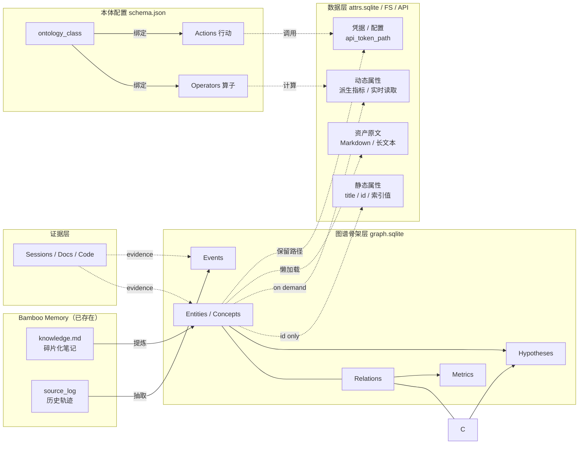
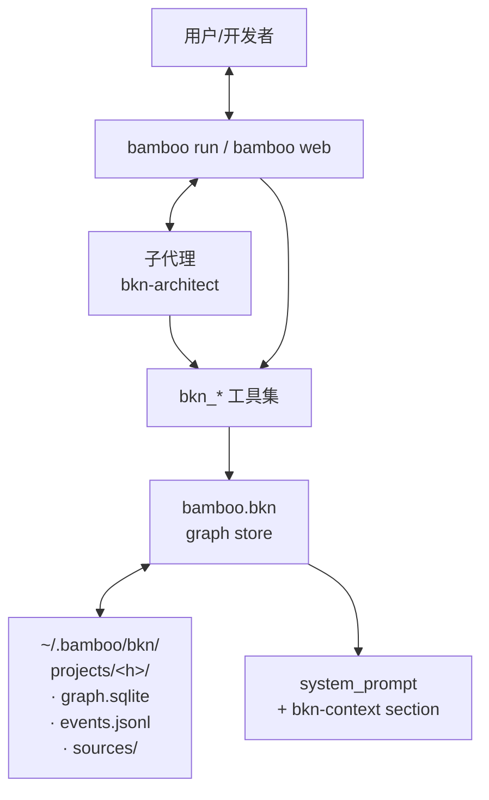
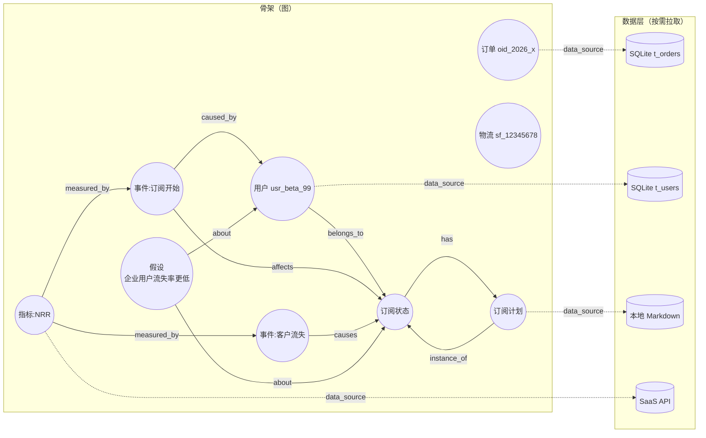
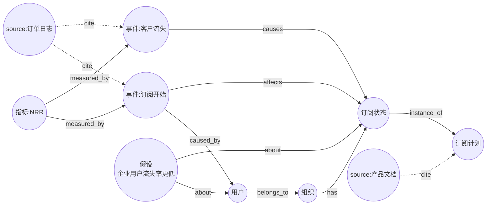
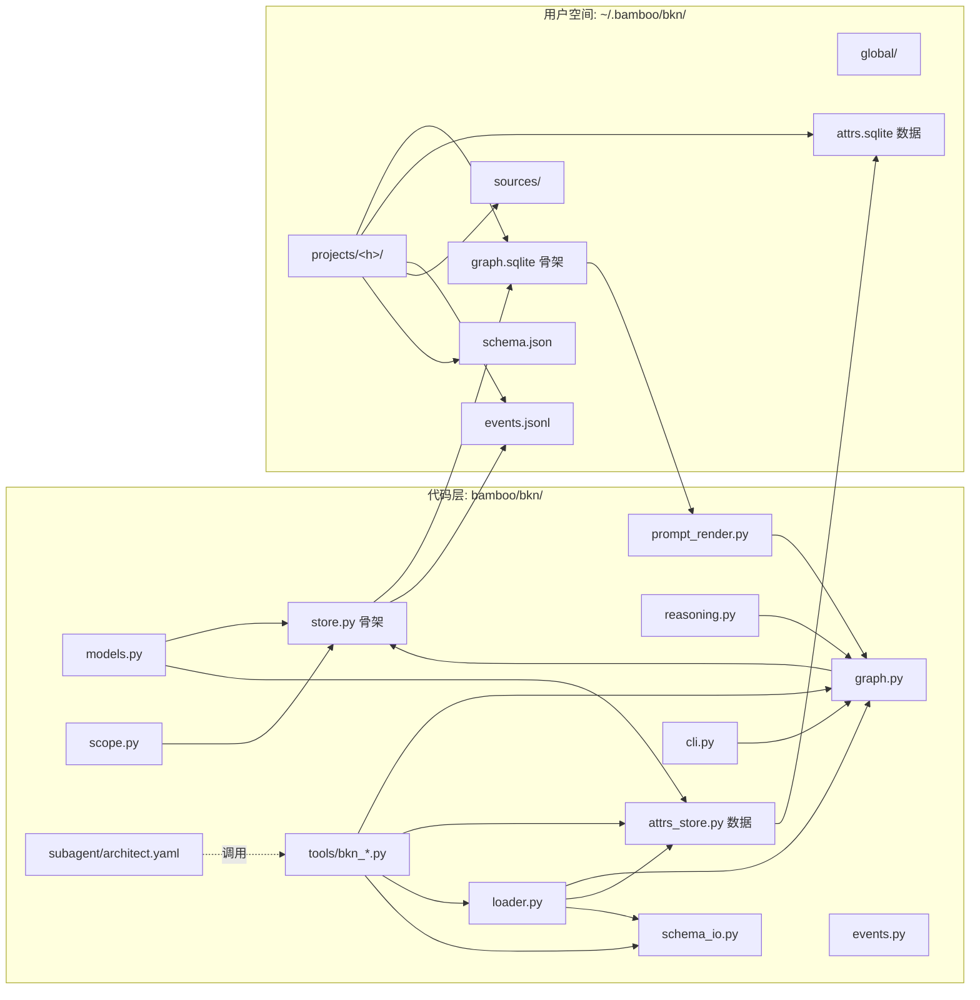
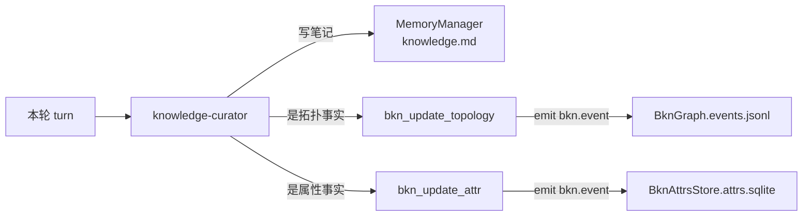
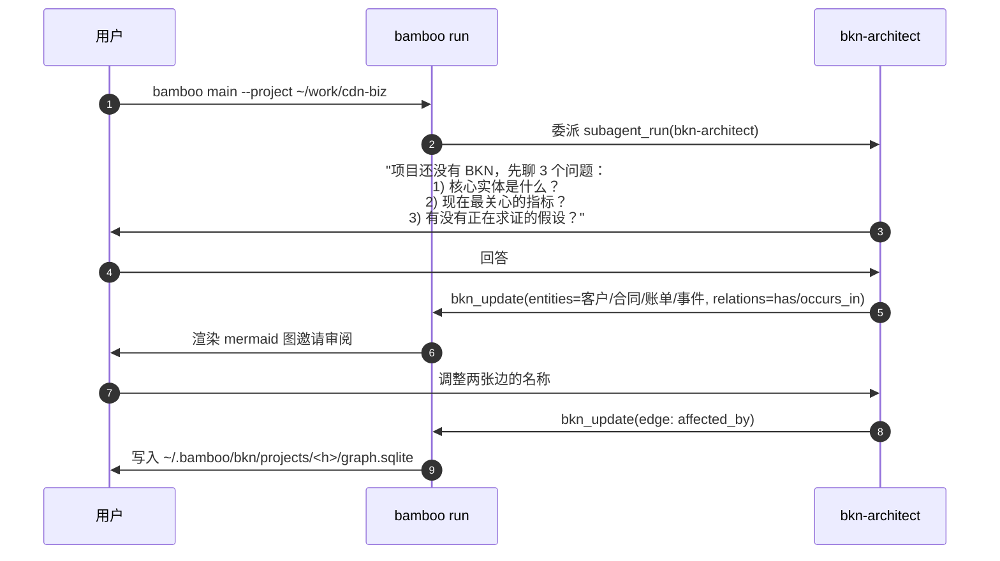
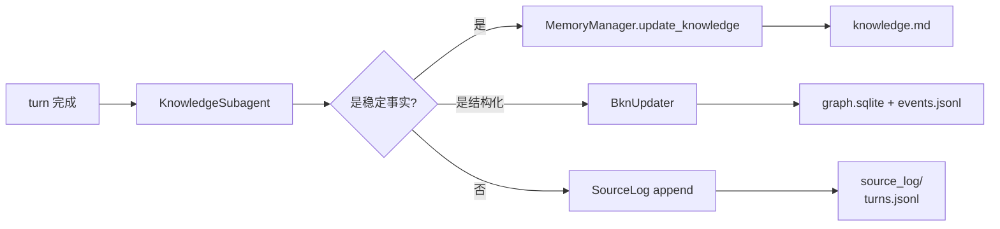

# BKN（业务数据知识网络）设计方案

> 目标：在 Bamboo 之上引入一层 **业务数据知识网络（Business Knowledge Network）**，让 Bamboo
> 能与用户协作分析数据、迭代式地构建出可推理的业务知识网络，并在每次会话中作为结构化上下文生效。
>
> 本文档与 `docs/bkn-design.md`（平台数据对接）相互独立但互补：那份负责"接哪条数据管道"，
> 这份负责"沉淀出什么样的业务世界模型"。

---

## 1. 概念：什么是 BKN

BKN 不是把数据塞进 LLM 的 context，也不是文档 + embedding 的 RAG。它是一种 **结构化的业务世界模型**，
参考 KWeaver 的本体论，分为三个维度：

| 维度                | 含义                                                                  |
|---------------------|-----------------------------------------------------------------------|
| **Entities / Concepts** | 业务中的真实对象、抽象概念（用户、订单、产品、订阅状态、风险等级……） |
| **Relations**       | 实体/概念之间的关系：`has`、`belongs_to`、`occurs_in`、`caused_by`、`measured_by` |
| **Events**          | 业务中发生的事（用户付费、订单取消、设备故障），可追踪、可归因          |
| **Metrics**         | 指标（NRR、MTTR、转化率），绑定到实体或事件，可追溯计算口径              |
| **Hypotheses**      | 当前正在求证的业务假设，带证据链                                        |
| **Sources**         | 每一段断言的出处：上游数据、文档片段、对话片段、agent 推理              |
| **Operators**（新增）| 绑定在 ontology class 上的可调用逻辑：输入属性、产出衍生属性       |
| **Actions**（新增）  | 绑定在 ontology class 上的可执行工具：声明哪些 tool 是该节点合法的行动 |

KWeaver 的「八字段」方针在 BKN 里的体现：**图管关系、库管数据、配置管行为**。

- **图（`graph.sqlite`）**：只存 ID 和拓扑连线，绝不存文章正文、API 凭据这些"重数据"。
- **数据（`attrs.sqlite` / 文件系统 / API）**：节点静态/动态属性按需反查，避免与图谱产生同步延迟。
- **配置（`schema.json`）**：声明 ontology class 上挂的算子与行动，LLM 在 prompt 中看到的就是「受控清单」。

BKN 与 Bamboo 现有 `~/.bamboo/memory/projects/<hash>/knowledge/*.md` 的根本差别：

- `knowledge.md` 是 **自然语言笔记**，碎片、可读、适合塞进 prompt
- BKN 是 **结构化图谱**，可查询、可推理、可视化、可版本化，且与"数据层"显式解耦



---

## 2. 与 Bamboo 现有架构的边界

### 2.1 复用而非重写

| 已有组件                                 | 在 BKN 中的角色                                                       |
|------------------------------------------|-----------------------------------------------------------------------|
| `Context.project_root / memory_dir`      | 派生出 `bkn_dir`，复用 `get_memory_dir_name` 做 per-project 隔离      |
| `MemoryScope`（chat / project）          | BKN 也支持 per-project + chat-global 两级 scope，但走自己的目录       |
| `SourceLogMatch` & `search_source_logs`  | BKN 把历史会话当成 entity / event 的证据源之一，可继续走 source_log    |
| `EventBus`                               | BKN 改图时通过 `bkn.node.added` / `bkn.hypothesis.updated` 等事件暴露 |
| `SubagentDefinition`（buildin）          | 新增 `bkn-architect` 子代理，专门和用户对话构建图谱                    |
| `KnowledgeSubagent` / knowledge_curator  | 知识沉淀链路的下游：在 turn 结束后生成 BKN 更新提议，不直接改 md       |
| `PromptSection`                          | bkn 一份可序列化快照注入到 `system_prompt`，作为 `bkn-context` 节     |
| `Cron` heartbeat / `Workflow`            | 周期性把 `~/.bamboo/memory/projects/<h>/` 里的 md 反向萃取进 BKN      |

### 2.2 不动什么

- ✅ 不改 `MemoryManager` 的 append / replace / remove_matching 行为
- ✅ 不动 `system_prompt_build` 的 section 顺序，只加一个 section
- ✅ 不动 `Context` 必填字段，只增加可选字段
- ✅ 不内嵌向量数据库；初始版本用 SQLite + 文件 JSONL 即可

### 2.3 KWeaver 三层映射（核心约束）

延续 KWeaver 本体论的"图看关系、动态查数"的解耦思想，BKN 在写入和装载时必须遵守
以下三条不可打破的规则：

| 层          | 责任                       | 存储介质                                  | 写入工具                          |
|-------------|----------------------------|-------------------------------------------|-----------------------------------|
| 骨架层（图） | 谁和谁有关系                | `graph.sqlite` + `events.jsonl`            | `bkn_update_topology` / `bkn_link_source` |
| 数据层（库） | 每个节点的具体属性是什么     | `attrs.sqlite` / 本地 md / 远程 API        | `bkn_update_attr`                 |
| 配置层（行为）| 哪些算子/行动可以作用于哪些类 | `schema.json`                            | 用户手工编辑 + `bamboo bkn schema edit`     |

**强一致性不在图上做**——节点属性变化（如"文章更新一版"）走数据层，图保持稳定；
**拓扑变化**（新增节点、新增/删除边）才动 `events.jsonl`。这样避开分布式事务、规避同步延迟，
并保证 LLM 永远能拿到最新数据（Context Loader 实时反查）。



---

## 3. 数据模型

### 3.1 节点类型

```python
class NodeKind(str, Enum):
    entity       # 真实对象
    concept      # 抽象业务概念
    event        # 已发生的事
    metric       # 指标
    hypothesis   # 业务假设
    source       # 出处节点（对话、数据集、文档）
```

### 3.2 节点结构（骨架层，不再持有"重数据"）

```python
@dataclass(frozen=True, slots=True)
class BknNodeId:           # ULID 形式的 id
    value: str

@dataclass(frozen=True, slots=True)
class BknNode:
    """图谱骨架节点：只承载稳定元信息与大指针，不承载长文本/凭据/热数据。"""

    id: BknNodeId
    kind: NodeKind
    ontology_class: str                  # 引自 schema.json 的类名（Content / Tag / Platform ...）
    name: str                            # canonical name
    aliases: tuple[str, ...]             # 同义别名
    description: str                     # 短描述，可入 prompt
    static_attrs: Mapping[str, str]      # 仅放稳定元属性（id 描述、单位、索引名）；其余 attrs 走数据层
    data_source: BknDataSourceRef | None # 指向 attrs.sqlite 行 / 文件路径 / API endpoint
    evidence_ids: tuple[BknNodeId, ...]
    confidence: float
    created_at: datetime
    updated_at: datetime
    version: int = 1

@dataclass(frozen=True, slots=True)
class BknDataSourceRef:
    """节点 → 数据层的指针（KWeaver 风格的"数据虚拟化引用"）。"""

    kind: Literal["sqlite_row", "file_path", "api_endpoint"]
    location: str                # 例如 attrs.sqlite:t_content:content_001 / ~/my_blogs/a.md / https://...
    field_mapping: Mapping[str, str] = field(default_factory=dict)  # 名字 → 真实字段
```

### 3.3 关系

```python
@dataclass(frozen=True, slots=True)
class BknEdge:
    id: BknEdgeId
    src: BknNodeId
    dst: BknNodeId
    relation: str          # has / belongs_to / occurs_in / caused_by / measured_by ...
    weight: float = 1.0    # 解释力权重，可用于推理排序
    evidence_ids: tuple[BknNodeId, ...] = ()
    created_at: datetime
```

### 3.4 事件 / 假设 / 来源

```python
@dataclass(frozen=True, slots=True)
class BknEvent(BknNode):     # kind == "event"
    occurred_at: datetime
    payload_ref: BknDataSourceRef | None = None   # 事件载荷也走数据层

@dataclass(frozen=True, slots=True)
class BknHypothesis(BknNode):  # kind == "hypothesis"
    status: Literal["open", "supported", "weakened", "refuted"]
    supporting: tuple[BknNodeId, ...] = ()
    contradicting: tuple[BknNodeId, ...] = ()

@dataclass(frozen=True, slots=True)
class BknSource(BknNode):     # kind == "source"
    location: str              # session://.../turn... 或 file://... 或 url://...
    excerpt: str
```

### 3.5 算子（Operator）与行动（Action）

```python
@dataclass(frozen=True, slots=True)
class OperatorSpec:
    """绑定在 ontology_class 上的可调用逻辑（KWeaver 维度 2：动态属性 → 算子）。"""

    name: str                          # e.g. "Calculate_Engagement_Rate"
    description: str
    entry: str                         # 白名单 python 入口：bamboo.bkn.operators.engagement_rate
    inputs: Mapping[str, str]          # 输入属性名 → 类型
    outputs: Mapping[str, str]         # 输出衍生属性名 → 类型
    timeout_seconds: float = 5.0

@dataclass(frozen=True, slots=True)
class ActionSpec:
    """绑定在 ontology_class 上的可执行工具（KWeaver 维度 3：API/工具）。"""

    name: str                          # e.g. "SyncToPlatform"
    description: str
    tool: str                          # 注册表里的工具名，例如 "bkn_action_sync"
    bindings: tuple[str, ...] = ()     # 挂在哪些 ontology_class 上
    param_schema: Mapping[str, object] = field(default_factory=dict)
    post_hooks: tuple[BknPostHook, ...] = ()   # 行动执行后异步写图
```

### 3.6 本体配置 schema.json 示例（数据层之外、决定行为）

```json
{
  "version": 1,
  "classes": {
    "Content": {
      "static_attrs": ["title", "tags", "published_at"],
      "data_source": { "kind": "sqlite_row", "table": "t_content" },
      "operators": [],
      "actions": ["OptimizeKeywords", "SyncToPlatform"]
    },
    "AssetMetrics": {
      "static_attrs": ["viewCount", "likeCount", "commentCount"],
      "data_source": { "kind": "api_endpoint", "location": "platform://{platform_id}/metrics/{content_id}" },
      "operators": ["Calculate_Engagement_Rate"],
      "actions": []
    },
    "Tag": {
      "static_attrs": ["tagName"],
      "operators": ["Analyze_Tag_Trend"],
      "actions": []
    },
    "Platform": {
      "static_attrs": ["platformName", "credentialRef"],
      "actions": []
    }
  },
  "operator_registry": {
    "Calculate_Engagement_Rate": "bamboo.bkn.operators.engagement.rate",
    "Analyze_Tag_Trend":        "bamboo.bkn.operators.tag.trend"
  },
  "action_registry": {
    "SyncToPlatform":     { "tool": "bkn_action_sync",    "default_targets": ["juejin", "wechat"] },
    "OptimizeKeywords":   { "tool": "bkn_action_optimize" }
  }
}
```

### 3.7 实体图示例（按"订阅 SaaS"业务画一个最小子图）





---

## 4. 目录与文件结构

```
bamboo/bkn/                          # 新模块
├── __init__.py
├── models.py                        # 上面所有 dataclass（骨架节点 / 数据源 / Operator / Action）
├── scope.py                         # BknScope: project / chat-global
├── store.py                         # SQLite + JSONL 持久化（append-only events）
├── graph.py                         # 骨架层 CRUD / 邻居查询 / 路径
├── attrs_store.py                   # 数据层（attrs.sqlite）+ 数据源 adapter 注册表
├── loader.py                        # BknLoader = Context Loader 引擎
├── reasoning.py                     # 路径查询、子图抽取、冲突检测
├── operators/                       # 算子注册（白名单 python entry）
│   └── engagement.py
├── actions/                         # 行动实现（每个对应 bkn_action_* 工具）
│   └── sync.py
├── prompt_render.py                 # BknSnapshot → PromptSection(content)
├── events.py                        # EventBus 上报的事件类型
├── schema_io.py                     # schema.json 读写 / 校验
├── subagent/                        # bkn-architect 子代理运行时配置
│   └── architect.yaml
├── tools/                           # 暴露给主 agent / subagent 的 bkn_* 工具
│   ├── bkn_query.py                 # 骨架查询
│   ├── bkn_load_context.py          # Context Loader 入口
│   ├── bkn_update_topology.py       # 改图专用
│   ├── bkn_update_attr.py           # 改数据层专用
│   ├── bkn_propose.py
│   ├── bkn_link_source.py
│   ├── bkn_run_operator.py
│   ├── bkn_list_actions.py
│   ├── bkn_explain.py
│   └── bkn_export.py
└── cli.py                           # bamboo bkn 子命令的入口

~/.bamboo/bkn/                       # 用户空间层
├── global/
│   └── concepts.json                # 跨项目共享的概念字典（可选）
└── projects/<project_hash>/
    ├── graph.sqlite                 # 最新骨架图状态（节点/边/版本/反范式索引）
    ├── events.jsonl                 # append-only 操作日志（用于回放 / 审计）
    ├── attrs.sqlite                 # 数据层：节点静态/动态属性 + 用户资产
    ├── data_sources/                # 索引数据源（已抓取快照、缓存）
    ├── sources/                     # 引用的源文档 / 会话片段
    └── schema.json                  # 本项目的本体配置（ontology_class + 算子 + 行动）
```



---

## 5. 核心 API

### 5.1 graph.py（骨架层接口——只动 ID 与拓扑）

```python
class BknGraph:
    def __init__(self, scope: BknScope): ...

    # ── 写入：拓扑变更，永远不改数据层 ────────────────────────────────
    def upsert_node(self, node: BknNode) -> BknNode: ...
    def upsert_edge(self, edge: BknEdge) -> BknEdge: ...

    # ── 查询：只读，返回 frozen dataclass；结果仅含骨架属性 ─────────────
    def get_node(self, node_id: BknNodeId) -> BknNode | None: ...
    def find_nodes(self, *, name: str | None = None,
                   kind: NodeKind | None = None,
                   ontology_class: str | None = None,
                   alias: str | None = None) -> list[BknNode]: ...
    def neighborhood(self, node_id: BknNodeId,
                     *, depth: int = 1,
                     ontology_class: str | None = None) -> BknSubgraph: ...
    def path(self, src: BknNodeId, dst: BknNodeId,
             *, max_depth: int = 4) -> list[BknEdge]: ...
    def search_by_text(self, query: str, *, limit: int = 10) -> list[BknNode]: ...
```

### 5.2 attrs_store.py + loader.py（数据层 + Context Loader）

```python
class BknAttrsStore:
    """节点 → 数据源的读写，与 graph 解耦。"""

    def get_attrs(self, node: BknNode, *, keys: tuple[str, ...] | None = None) -> Mapping[str, object]: ...
    def update_attrs(self, node_id: BknNodeId,
                     *, values: Mapping[str, object],
                     source_ref: str = "") -> BknAttrUpdateResult: ...

class BknDataSourceAdapter(Protocol):
    """三类适配器：sqlite_row / file_path / api_endpoint。"""

    def fetch(self, ref: BknDataSourceRef, *, keys: tuple[str, ...]) -> Mapping[str, object]: ...

class BknLoader:
    """Context Loader（KWeaver 核心）：focus → 装配好的上下文。"""

    def __init__(self, graph: BknGraph, attrs: BknAttrsStore, schema: BknSchema): ...

    def load(self, *, focus: tuple[BknNodeId, ...],
             depth: int = 1,
             include_attrs: bool = True,
             run_operators: tuple[str, ...] = (),
             available_actions: tuple[str, ...] = (),
             max_nodes: int = 80) -> BknSnapshot: ...
```

`BknSnapshot` 的 schema（agent 真正看到的东西）：

```yaml
skeleton:                # 拓扑骨架（mermaid friendly）
  - (uid1)-[PUBLISHED_ON]->(uid2)
static_attrs:            # 数据层按需反查结果
  uid1: { title: "...", body_md_path: "~/..." }
operator_outputs:        # 计算结果缓存
  uid3: { engagement_rate: "4.2%" }
available_actions:       # 受 schema 约束的行动清单
  - { name: SyncToPlatform, tool: bkn_action_sync, param_schema: {...} }
open_hypotheses:
  - "企业用户流失率更低 (status=open, +3 -1)"
```

### 5.3 tools 包（agent 可调用）

| 工具                  | 作用                                                                     |
|-----------------------|--------------------------------------------------------------------------|
| `bkn_query`           | 仅骨架查询：邻居 / 路径 / 全文检索（不拉数据层）                          |
| `bkn_load_context`    | **Context Loader** 入口：返回装配好的 `BknSnapshot`                       |
| `bkn_update_topology` | 改图专用（节点 / 边），要求带 evidence                                    |
| `bkn_update_attr`     | 改数据层专用（不触图）                                                    |
| `bkn_propose`         | 提交假设，写入 `Hypothesis(status=open)`                                  |
| `bkn_link_source`     | 把 source_log 的某条记录 attach 到现有节点                                |
| `bkn_run_operator`    | 触发 schema 中白名单声明的算子（不开放任意代码执行）                        |
| `bkn_list_actions`    | 列举 schema 允许的行动（让 LLM 知道"我只能调这些"）                       |
| `bkn_explain`         | 给定节点生成自然语言解释，写入 source                                      |
| `bkn_export`          | 把当前项目 BKN 导出成 mermaid / dot / md 供用户审阅                       |

### 5.4 子代理：bkn-architect

继承现有的 `SubagentDefinition`：

```yaml
name: bkn-architect
description: 与用户对话，一起设计、修订、补全项目级业务知识网络（BKN）。
model: knowledge_curator    # 复用已有角色
permission: read-only       # 写操作只通过 bkn_update_* 工具
workspace_mode: read_only
tools:
  bkn_query: true
  bkn_load_context: true
  bkn_update_topology: true
  bkn_update_attr: true
  bkn_propose: true
  bkn_link_source: true
  bkn_run_operator: true
  bkn_list_actions: true
  bkn_explain: true
  bkn_export: true
  read: true
  grep: true
  skill_load: true
  bash: false
  write: false
  edit: false
```

---

## 6. Bamboo 集成点

### 6.1 在 system prompt 注入 BKN 上下文（graph → loader 视角）

在 `core/system_prompt_build._build_environment_section` 之后追加一个 section：

```python
def _build_bkn_section(bkn_dir: Path, snapshot: BknSnapshot) -> PromptSection:
    return PromptSection(
        name="bkn-context",
        source=f"bkn:{bkn_dir}",
        priority=850,                              # 在 env 之下、project instruction 之上
        cacheable=True,
        content=render_bkn_snapshot(snapshot),
    )
```

主流程（KWeaver 标准四步法：意图识别 → 拓扑定位 → Context Loader → 决策行动）：

```mermaid
sequenceDiagram
    autonumber
    participant U as User
    participant B as bamboo runtime
    participant P as SystemPromptBuilder
    participant G as BknGraph (骨架)
    participant A as BknAttrsStore (数据层)
    participant L as BknLoader (Context Loader)
    participant LLM as LLM

    U->>B: 主消息
    B->>P: build_sections(... focus_nodes)
    P->>L: load(focus=session.focus_nodes, depth=1,
                 include_attrs, run_operators, available_actions)
    L->>G: neighborhood(focus)
    G-->>L: BknSubgraph (骨架)
    L->>A: get_attrs(node, keys) × N
    A-->>L: static_attrs × N
    L->>L: run_operators → operator_outputs
    L->>L: filter actions by schema.json
    L-->>P: BknSnapshot (skeleton + attrs + ops + actions + hypotheses)
    P-->>B: list[PromptSection] + bkn-context section
    B->>LLM: 喂
    LLM-->>B: tool_call: bkn_update_topology / bkn_update_attr / bkn_run_operator
    alt 改拓扑
        B->>G: 写入（带 evidence）→ events.jsonl
        G-->>B: 新版本号 + 事件 bkn.node.changed
    else 改数据
        B->>A: update_attrs(values, source_ref)
        A-->>B: BknAttrUpdateResult
    end
    B->>U: 流式回复
```

### 6.2 与现有 knowledge.md 的桥接

`knowledge.md` 仍然存在，向下兼容。BKN 沉淀代理（knowledge-curator）现在多一条流水线：



转换规则（实现期定义）：
- `Knowledge.md` 中以 `- ` 开头、含 `:` 的事实行 → 抽取为 `BknNode(kind=entity|concept)`
- 含 `->` 或 `→` 的行 → 抽取为 `BknEdge`
- 含 "假设" / "可能" / "待验证" → `BknHypothesis(status=open)`

### 6.3 更新语义：属性 vs 拓扑（不可混用）

KWeaver 第二段那个"换货 / 拆单"的洞见，必须原样搬进 BKN 的写入路径：

| 变更类型                         | 走哪条工具          | 是否动 `events.jsonl` | 示例                                              |
|----------------------------------|---------------------|-----------------------|---------------------------------------------------|
| 节点静态/动态属性变化              | `bkn_update_attr`   | 否（仅 attrs.sqlite） | "文章标题改了" / "NRR 重新计算"                  |
| 节点出现 / 消失                    | `bkn_update_topology` + `bkn_update_attr` | 是 | "新增一个 Content 节点"            |
| 关系的新增 / 删除                  | `bkn_update_topology` | 是                   | "把订单 oid_x 重新挂到新物流单"                   |
| 行动触发的拓扑副作用              | `ActionSpec.post_hooks` 异步追加 events | 是                   | 拆单后新增 `SUB_ORDER_OF` 关系                    |

**禁止**用 `bkn_update_topology` 改属性；**禁止**用 `bkn_update_attr` 改图。这条规则
在工具实现层 hardcode 校验，避免日后"我直接 update 一行属性图里也跟着变了"的脏数据。

### 6.4 配置入口：configs/bkn.yaml

```yaml
bkn:
  enabled: true
  storage: sqlite                  # 后续可换 neo4j
  loader:
    depth: 2
    max_nodes: 80
    max_edges: 160
    include_attrs: true
    run_operators: ["Calculate_Engagement_Rate"]   # 默认触发的算子
    available_actions: []                          # 为空表示依 schema 暴露所有
  curator:
    bind_to_knowledge_curator: true
    require_evidence_for_topology_write: true
    allow_attr_write_without_evidence: true        # 属性变更门槛低于拓扑
  render:
    mermaid_in_prompt: true
    include_edges_in_text: true
  safety:
    operator_allowlist:
      - bamboo.bkn.operators.engagement.rate
      - bamboo.bkn.operators.tag.trend
    action_allowlist:
      - bkn_action_sync
      - bkn_action_optimize
```

并接入 `configs/bamboo_main_agent.yaml.auxiliary_models` 已有的 `knowledge_curator` 字段：
bkn-architect 复用 `knowledge_curator` 作为 model。

---

## 7. 端到端用户场景

### 7.1 场景一：用户首次进入项目



### 7.2 场景二：业务分析时调用 BKN（KWeaver 四步法）

```mermaid
sequenceDiagram
    autonumber
    participant U as 用户
    participant B as main agent
    participant Q as bkn_query
    participant L as bkn_load_context
    participant G as BknGraph (骨架)
    participant A as BknAttrsStore (数据层)
    participant Op as bkn_run_operator
    participant Ac as bkn_action_sync

    U->>B: "为什么本月 NRR 下降了？"
    Note over B: ① 意图识别 / 路由<br/>识别 NRR + month
    B->>Q: bkn_query(metric=NRR, depth=2)
    Q->>G: neighborhood(NRR_id)
    G-->>Q: BknSubgraph
    Q-->>B: NRR 关联的 events / hypotheses
    B->>L: bkn_load_context(focus=[NRR_id, Event_id, ...],
                           include_attrs, run_operators)
    Note over L: ②+③ 数据反查 + 算子挂载
    L->>A: get_attrs(...)
    A-->>L: 静态属性
    L->>Op: 触发 Calculate_Engagement_Rate
    Op-->>L: 衍生指标
    L-->>B: BknSnapshot（骨架 + attrs + ops + actions）
    Note over B: ④ 决策 / 行动
    B->>Ac: bkn_action_sync(targets=[juejin], content_id="content_001")
    Ac-->>B: 调用结果（同步行动 1 个，Post-Hook 写入 events.jsonl）
    B->>U: 综合解释 + 报告已同步动作
```

### 7.3 场景三：会话结束异步沉淀



---

## 8. 实现路线（不并行，按依赖分阶段）

### Phase 1：骨架 + 数据层 + 配置层（2 PR）

- 新建 `bamboo/bkn/` 包：`models / scope / store / attrs_store / graph / schema_io`
- 新建 `~/.bamboo/bkn/` 目录结构（**含 attrs.sqlite**）
- 骨架与数据两层各有自己的 SQLite schema
- 提供 `BknGraph` 与 `BknAttrsStore` 最小 CRUD
- `BknDataSourceAdapter` 注册表 + 默认 `sqlite_row / file_path` 两个实现
- `schema.json` 读写与校验
- 单测覆盖率 ≥ 80%

### Phase 2：工具 + 子代理（1~2 PR）

- `bkn_query / bkn_update_topology / bkn_update_attr / bkn_propose` 工具
- `subagent_run` 注册 `bkn-architect`
- 在 `commands/buildin/` 注册 `bkn-architect.yaml`
- 写工具实现层 hardcode「禁止混用」校验

### Phase 2.5：Context Loader + 算子 + 行动（1~2 PR）⭐ KWeaver 关键步骤

- `BknLoader.load(focus, depth, ...)` 实现
- `operators/engagement.py` 与 `operators/tag.py` 算子样例
- `actions/sync.py` 对应的 `bkn_action_sync` 工具
- `bkn_run_operator / bkn_list_actions / bkn_load_context` 三个新工具
- 算子白名单 `operator_allowlist` 强制校验

### Phase 3：与 prompt / memory 集成（1 PR）

- `Context` 增加可选 `bkn_dir`
- `SystemPromptBuilder` 注入 `bkn-context` section（用 `BknLoader.load` 装配）
- `KnowledgeSubagent` 末尾追加 BKN 提升调用，区分写拓扑 vs 写属性

### Phase 4：可视化与导出（1 PR）

- `bkn_export` 生成 mermaid / dot（同时输出骨架图 + 数据源清单）
- Web adapter 增加一个 `/bkn` 页用 mermaid 渲染当前项目图

### Phase 5：图推理（后续）

- `reasoning.py` 加入最短路径、冲突检测、按权重排序的事实排序
- 评估：能否回答"为什么会发生 X？"

### Phase 6：迁移与回填（按需）

- `bamboo bkn migrate` 把已有 `knowledge.md` 按行抽取为 BKN 骨架 + 数据层
- 提供 dry-run 模式与冲突报告

---

## 9. 风险与权衡

| 风险                                          | 缓解                                                                  |
|-----------------------------------------------|-----------------------------------------------------------------------|
| BKN 与 LLM 自由发挥的记忆冲突                  | 写入拓扑强制带 `evidence_ids`；`confidence` 字段；写失败回滚           |
| BKN 节点膨胀导致 prompt 爆炸                  | `BknLoader.load` 提供 `max_nodes / depth / focus` 限制；按 relation 重要度剪枝 |
| 持久层选型过早                                | Phase 1 用 SQLite；接口全部抽到 `BknGraph`，后续可替换为真正图库         |
| 现有项目用户开箱丢失历史                       | 提供 `knowledge.md → BKN` 的一次性迁移脚本（`bamboo bkn migrate`）      |
| BKN 子代理产生幻觉节点                        | `bkn_update_topology` 工具要求 review；存储 `proposed_by: agent / approved_by: human` 字段 |
| **数据源不可用 / 反查超时**                    | `BknAttrsStore` 内置 timeout + 重试；失败回退到骨架，`BknSnapshot` 中标记 `attrs_unavailable` |
| **数据层与图谱漂移不一致**                    | 严格遵守「属性走 attrs、拓扑走 graph」分层；写工具层 hardcode 校验两者不混用 |
| **算子 / 行动能力泄漏**                       | `operator_allowlist` / `action_allowlist` 双白名单；LLM 只能调 schema 暴露的方法 |

---

## 10. 一句话总结

> **BKN = Bamboo 里的一张「业务世界地图」。** 它让 Bamboo 不再只是"看代码、改代码"，而是
> 「先和用户一起把业务画清楚，再带着这张地图去工作」。

### 设计哲学（KWeaver 八字段）

> **图看关系，动态查数；行为受控，演化可追。**

- 图（`graph.sqlite`）只存"谁和谁有关系"，轻量且稳定；
- 数据（`attrs.sqlite` / 文件 / API）走数据源注册表，Context Loader 按 focus 实时反查；
- 行为（`schema.json`）声明哪些算子、哪些行动可作用于哪些 ontology class，LLM 只在受控清单内做决策；
- 所有图谱拓扑变更都是 `events.jsonl` 的 append，可回放、可审计、可回滚；
- Bamboo 现有 `MemoryManager` / `KnowledgeSubagent` / `PromptSection` 全部保持现有行为，BKN 是叠加层而非替换层。
