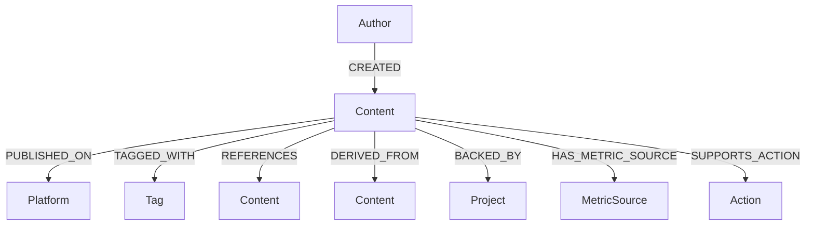

# Bamboo BKN Neo4j 直连版设计

## 背景

如果用户已经安装 Neo4j，BKN 可以不再把实体和关系主要存成 YAML 文件，而是直接把“业务对象与关系拓扑”放进 Neo4j。`~/.bamboo/bkn` 仍然保留，但它的职责从“承载全部图谱数据”调整为“声明、说明、使用经验、图谱结构文档和 Neo4j 连接配置”。

这个版本更贴近 KWeaver 的设计：

- Neo4j 保存对象、关系、标签、引用、平台归属等拓扑信息。
- 平台 API、本地文件、SQLite、CSV 或脚本保存实时属性和指标。
- BKN 包负责告诉 Bamboo：这个知识网络是什么、图谱长什么样、怎么查、有什么经验、哪些数据源和动作可以挂载。
- `bkn_retrieval` 在运行时查询 Neo4j，再按配置装载动态属性、算子结果和可行动作。

## 设计目标

1. 在 `~/.bamboo/bkn/{network_name}` 下以文档和配置声明一个 BKN 网络。
2. `BKN.md` 作为入口文件，类似 `SKILL.md`，描述这个知识网络的用途、触发场景和边界。
3. 单独维护图谱结构文档，说明 Neo4j 中的节点、关系、约束、索引和示例查询。
4. 单独维护使用经验文档，记录 Agent 如何有效查询和使用这个 BKN。
5. 图谱数据直接存 Neo4j，Bamboo 通过 `bkn_retrieval` 查询。
6. 保留动态数据源和 action 映射能力，但第一阶段仍只让 `bkn_retrieval` 做只读召回。

## 用户目录结构

建议目录如下：

```text
~/.bamboo/
  bkn/
    personal-media/
      BKN.md
      config.yaml
      graph-structure.md
      experiences.md
      neo4j/
        schema.cypher
        seed.cypher
        queries.yaml
      sources/
        platforms.yaml
        metrics.yaml
      operators/
        content_roi.yaml
      actions/
        publish.yaml
      assets/
        graph-overview.mmd
```

目录职责：

- `BKN.md`：知识网络入口文件，类似 Skill 的 `SKILL.md`。
- `config.yaml`：机器可读配置，包括 Neo4j 连接、默认检索策略、动态数据源开关。
- `graph-structure.md`：当前 BKN 的图谱结构说明。
- `experiences.md`：当前 BKN 的使用经验，记录有效查询方式、踩坑、Agent 使用原则。
- `neo4j/schema.cypher`：Neo4j 约束、索引、基础 schema 初始化语句。
- `neo4j/seed.cypher`：可选的初始图谱数据。
- `neo4j/queries.yaml`：命名 Cypher 查询模板，供 `bkn_retrieval` 使用。
- `sources/`：动态数据源配置。
- `operators/`：只读算子配置。
- `actions/`：可行动作元数据。
- `assets/graph-overview.mmd`：图谱结构图，建议用 Mermaid，便于文档展示。

## BKN.md 设计

`BKN.md` 是给 Agent 和人看的入口说明。它不存大规模数据，只描述这个知识网络适用于什么任务。

示例：

```md
# BKN: personal-media

## Description

个人多平台内容资产知识网络，用来分析文章、视频、代码仓库、平台、标签、作者、发布记录和内容复用关系。

## When To Use

- 用户询问某个内容资产、平台、标签、作者或内容表现。
- 用户需要跨平台比较内容表现。
- 用户想找可复投、可改写、可同步发布的旧内容。
- 用户需要理解内容之间的引用、衍生、复用关系。

## Do Not Use

- 单纯询问 Bamboo 代码实现。
- 不涉及内容资产、平台数据或图谱关系的问题。

## Retrieval Strategy

优先用实体 ID、标题、标签、平台名定位节点；如果用户问趋势或表现，再装载动态 metrics；如果用户问下一步动作，再返回 actions 元数据。

## Safety

`bkn_retrieval` 只读。发布、同步、删除等动作必须交给独立 Tool 或 workflow，并经过权限确认。
```

## config.yaml 设计

```yaml
schema_version: 1
name: personal-media
description: 个人多平台内容资产知识网络
enabled: true

driver:
  type: neo4j
  uri: bolt://localhost:7687
  database: neo4j
  auth:
    username_env: BKN_PERSONAL_MEDIA_NEO4J_USER
    password_env: BKN_PERSONAL_MEDIA_NEO4J_PASSWORD

documents:
  entry: BKN.md
  graph_structure: graph-structure.md
  experiences: experiences.md

retrieval:
  default_query: entity_search
  default_limit: 5
  max_limit: 20
  default_hops: 2
  max_hops: 3
  include_graph_structure: false
  include_experiences: true
  include_dynamic_data: true
  include_actions: true

neo4j:
  schema_file: neo4j/schema.cypher
  seed_file: neo4j/seed.cypher
  queries_file: neo4j/queries.yaml

sources:
  - sources/platforms.yaml
  - sources/metrics.yaml

operators:
  - operators/content_roi.yaml

actions:
  - actions/publish.yaml
```

安全建议：

- 不要把 Neo4j 密码直接写进 `config.yaml`。
- 使用环境变量引用凭据。
- 第一阶段只允许读查询，拒绝执行包含 `CREATE`、`MERGE`、`SET`、`DELETE`、`DROP`、`CALL dbms` 等写入或管理语句的模板。

## graph-structure.md 设计

这个文档说明“当前 BKN 的图谱结构”。它是给开发者和 Agent 理解图模型用的，不是存数据的地方。

建议内容：

```md
# personal-media 图谱结构

## Node Labels

### Content

内容资产。包括文章、视频、笔记、代码案例、播客等。

Required:
- id
- title
- content_type

Optional:
- url
- summary
- created_at
- updated_at

### Platform

平台，例如 GitHub、知乎、B 站、公众号、掘金。

Required:
- id
- name
- platform_type

### Tag

主题标签，例如 AI Agent、Memory、RAG、Neo4j。

Required:
- id
- name

### Author

作者或账号。

Required:
- id
- name

## Relationship Types

### (:Content)-[:PUBLISHED_ON]->(:Platform)

表示内容发布在哪个平台。

### (:Content)-[:TAGGED_WITH]->(:Tag)

表示内容绑定主题标签。

### (:Content)-[:REFERENCES]->(:Content)

表示内容之间的引用关系。

### (:Content)-[:DERIVED_FROM]->(:Content)

表示内容由另一份内容改写、复用或衍生。

### (:Author)-[:CREATED]->(:Content)

表示作者创建内容。

## Query Patterns

- 从标签找内容：Tag -> Content -> Platform。
- 从内容找可复投资产：Content -> Tag -> 相同 Tag 的其他 Content。
- 从平台分析表现：Platform -> Content -> metrics source。
```

## experiences.md 设计

`experiences.md` 类似 Skill 的使用经验，但面向一个具体 BKN。它记录哪些查询方式、实体识别方式和上下文装载方式更有效。

示例：

```md
# personal-media 使用经验

## Entity Matching

- 用户提到文章标题时，优先匹配 `Content.title`。
- 用户提到 GitHub、知乎、B 站、公众号时，优先匹配 `Platform.name`。
- 用户提到 AI Agent、RAG、Memory 等主题时，优先匹配 `Tag.name`。

## Retrieval

- 分析内容表现时，必须 include_dynamic_data。
- 分析复投机会时，max_hops 至少为 2，因为需要从 Content 扩展到 Tag，再扩展到相同 Tag 下的其他 Content。
- 用户问“下一步怎么做”时，include_actions 应为 true。

## Answering

- 不要只返回图谱关系，要结合动态指标解释推荐理由。
- 如果动态数据缺失，明确说图谱中存在关系，但缺少最新指标。
- 发布、删除、同步等动作不要直接执行，只建议调用哪个 workflow 或 tool。
```

## Neo4j 图模型

建议第一阶段使用属性图模型，节点和关系尽量少而稳定。

### 核心节点

- `Content`：内容资产。
- `Platform`：发布或托管平台。
- `Tag`：主题标签。
- `Author`：作者或账号。
- `Project`：关联项目或代码库，可选。
- `MetricSource`：指标来源，可选，用于描述指标从哪里来。
- `Action`：可用动作，可选。如果不想把 action 存图里，也可以只放 `actions/*.yaml`。

### 核心关系

- `(:Author)-[:CREATED]->(:Content)`
- `(:Content)-[:PUBLISHED_ON]->(:Platform)`
- `(:Content)-[:TAGGED_WITH]->(:Tag)`
- `(:Content)-[:REFERENCES]->(:Content)`
- `(:Content)-[:DERIVED_FROM]->(:Content)`
- `(:Content)-[:BACKED_BY]->(:Project)`
- `(:Content)-[:HAS_METRIC_SOURCE]->(:MetricSource)`
- `(:Content)-[:SUPPORTS_ACTION]->(:Action)`

### Mermaid 总览



## Neo4j schema.cypher

`neo4j/schema.cypher` 建议只放约束和索引：

```cypher
CREATE CONSTRAINT content_id IF NOT EXISTS
FOR (n:Content) REQUIRE n.id IS UNIQUE;

CREATE CONSTRAINT platform_id IF NOT EXISTS
FOR (n:Platform) REQUIRE n.id IS UNIQUE;

CREATE CONSTRAINT tag_id IF NOT EXISTS
FOR (n:Tag) REQUIRE n.id IS UNIQUE;

CREATE CONSTRAINT author_id IF NOT EXISTS
FOR (n:Author) REQUIRE n.id IS UNIQUE;

CREATE INDEX content_title IF NOT EXISTS
FOR (n:Content) ON (n.title);

CREATE INDEX platform_name IF NOT EXISTS
FOR (n:Platform) ON (n.name);

CREATE INDEX tag_name IF NOT EXISTS
FOR (n:Tag) ON (n.name);
```

如果 Neo4j 版本支持全文索引，建议增加：

```cypher
CREATE FULLTEXT INDEX contentSearch IF NOT EXISTS
FOR (n:Content|Platform|Tag|Author)
ON EACH [n.id, n.title, n.name, n.summary];
```

## neo4j/queries.yaml

查询模板应该命名化，不建议让 LLM 直接生成任意 Cypher。

```yaml
queries:
  entity_search:
    description: 按关键词搜索 Content、Platform、Tag、Author
    mode: read
    cypher: |
      CALL db.index.fulltext.queryNodes("contentSearch", $query)
      YIELD node, score
      RETURN node, labels(node) AS labels, score
      ORDER BY score DESC
      LIMIT $limit

  content_neighborhood:
    description: 查询内容资产的邻域
    mode: read
    cypher: |
      MATCH (c:Content {id: $entity_id})
      OPTIONAL MATCH path = (c)-[*1..$max_hops]-(n)
      RETURN c, collect(path) AS paths
      LIMIT 1

  tag_related_content:
    description: 从标签查相关内容
    mode: read
    cypher: |
      MATCH (t:Tag)
      WHERE toLower(t.name) CONTAINS toLower($tag)
      MATCH (c:Content)-[:TAGGED_WITH]->(t)
      OPTIONAL MATCH (c)-[:PUBLISHED_ON]->(p:Platform)
      RETURN c, t, collect(p) AS platforms
      LIMIT $limit
```

注意：Neo4j 不支持把关系深度 `[*1..$max_hops]` 在所有版本中参数化。实现时可以在 Python 侧校验 `max_hops` 后拼接成 `[*1..2]`，只允许 0 到 3 的整数。

## bkn_retrieval 查询流程

Neo4j 直连版 `bkn_retrieval` 流程：

1. 读取 `BKNRegistry` 中启用的 BKN。
2. 根据 `network` 参数选择一个或多个 BKN。
3. 读取 `config.yaml`，确认 driver 是 `neo4j`。
4. 根据 query 选择查询模板：
   - 有明确实体 ID：走 `content_neighborhood` 或对应 label 的 neighborhood 查询。
   - 有标签、平台、作者词：走专门模板。
   - 默认走 `entity_search`，再对命中实体做邻域扩展。
5. 通过 Neo4j driver 执行只读 Cypher。
6. 将节点、关系、路径转换成 BKN 内部 `BKNRetrievalMatch`。
7. 按配置装载动态数据源，例如阅读量、点赞数、stars。
8. 附加 operator/action 元数据。
9. 输出 XML/Markdown 给模型。

输出示例：

```xml
<bkn_results query="AI Agent 哪些旧内容适合复投" network="personal-media" count="2">
  <result index="1" entity_id="content:agent-memory-design" labels="Content" score="12.4">
    <summary>Agent Memory 设计笔记，关联 AI Agent、Memory 标签，已发布在 GitHub 和知乎。</summary>
    <graph>
      (:Content {id: "content:agent-memory-design"})-[:TAGGED_WITH]->(:Tag {name: "AI Agent"})
      (:Content {id: "content:agent-memory-design"})-[:PUBLISHED_ON]->(:Platform {name: "GitHub"})
    </graph>
    <dynamic_data>
      github_stars: 42
      zhihu_likes: 18
      last_30d_views: 1800
    </dynamic_data>
    <actions>
      - republish_content: 可调用 workflow_run，参数 content_id、target_platform
    </actions>
  </result>
</bkn_results>
```

## 需要新增和改动的代码

### 新增 bamboo/bkn 模块

```text
bamboo/bkn/
  __init__.py
  models.py
  registry.py
  loader.py
  store.py
  retrieval.py
  neo4j_client.py
  query_templates.py
  validator.py
```

职责：

- `models.py`：`BKNDefinition`、`BKNDocument`、`BKNNeo4jConfig`、`BKNRetrievalMatch` 等 dataclass。
- `loader.py`：加载 `BKN.md`、`config.yaml`、`graph-structure.md`、`experiences.md`。
- `registry.py`：扫描 `~/.bamboo/bkn/*/BKN.md` 或 `config.yaml`。
- `neo4j_client.py`：封装 Neo4j driver，只开放 read transaction。
- `query_templates.py`：加载和校验 `neo4j/queries.yaml`。
- `retrieval.py`：实现查询、邻域扩展、渲染。
- `validator.py`：校验 BKN 包结构、配置和 Cypher 模板安全。
- `store.py`：记录检索审计、缓存动态数据和状态。

### pyproject.toml

需要增加 Neo4j Python driver 依赖：

```toml
dependencies = [
  "neo4j>=5.0",
]
```

如果希望 Neo4j 是可选能力，可以使用 extra：

```toml
[project.optional-dependencies]
neo4j = ["neo4j>=5.0"]
```

可选依赖更稳妥。若未安装 `neo4j` 包，`bkn_retrieval` 对 Neo4j BKN 返回清晰错误：`neo4j driver is not installed`。

### userspace

改动 `bamboo/userspace/userspace.py`：

```python
dirs = [
    ...
    "bkn",
    "storage/bkn",
    "storage/bkn/cache",
    "storage/bkn/indexes",
]

def get_user_bkn_dir() -> Path:
    return get_userspace_dir() / "bkn"

def get_bkn_storage_dir() -> Path:
    return get_userspace_dir() / "storage" / "bkn"
```

### RuntimeContext

改动 `bamboo/runtime/runtime_context.py`：

```python
from bamboo.bkn import BKNRegistry, create_bkn_registry

@dataclass(slots=True)
class RuntimeContext:
    ...
    bkn_registry: BKNRegistry | None = None
```

`RuntimeContextBuilder.__init__` 增加：

```python
bkn_registry: BKNRegistry | None = None
```

并默认：

```python
self.bkn_registry = bkn_registry or create_bkn_registry()
```

`build()` 时写入：

```python
bkn_registry=self.bkn_registry
```

### Tool

新增：

```text
bamboo/tools/buildin/bkn_retrieval.py
```

接口：

```python
class BKNRetrievalTool(Tool):
    name = "bkn_retrieval"
    description = (
        "Retrieve Bamboo Knowledge Network context from Neo4j or configured BKN sources. "
        "Use it for platform data, business objects, graph relationships, dynamic metrics, "
        "operators, and available action metadata."
    )
    risk_level = "read"
    tags = ("bkn", "neo4j", "read", "retrieval")
```

输入：

```python
{
    "type": "object",
    "properties": {
        "query": {"type": "string"},
        "network": {"type": "string", "description": "BKN network name or auto."},
        "limit": {"type": "integer"},
        "max_hops": {"type": "integer"},
        "include_dynamic_data": {"type": "boolean"},
        "include_actions": {"type": "boolean"},
    },
    "required": ["query"],
}
```

注册：

- `bamboo/tools/buildin/__init__.py` 引入并返回 `BKNRetrievalTool()`。
- 更新 `tests/test_tool_registry.py`。

## Neo4j 连接管理

`neo4j_client.py` 应做几件事：

- 延迟创建 driver，避免 Bamboo 启动时强依赖 Neo4j 正常运行。
- 每次 retrieval 使用 read session。
- 支持 database 参数。
- 捕获连接失败并返回 ToolResult 错误，不让 AgentRuntime 崩溃。
- 对 query template 做只读校验。

伪代码：

```python
class BKNNeo4jClient:
    def __init__(self, config: BKNNeo4jConfig) -> None: ...

    def run_read(self, cypher: str, parameters: dict[str, object]) -> list[dict[str, object]]:
        self._ensure_safe_read_query(cypher)
        with self.driver.session(database=self.database) as session:
            result = session.execute_read(lambda tx: list(tx.run(cypher, parameters)))
        return [record.data() for record in result]
```

只读校验不能替代数据库权限。建议 Neo4j 使用只读账号，Bamboo 层校验只是第二道保护。

## BKN 包与 Neo4j 数据的关系

Neo4j 负责保存：

- 节点实例。
- 关系实例。
- 适合图查询的轻量属性，例如 `id`、`title`、`name`、`summary`、`type`。

BKN 包负责保存：

- 网络说明。
- 图谱结构说明。
- 使用经验。
- 查询模板。
- 数据源映射。
- 算子声明。
- 动作声明。

不建议放进 Neo4j 的内容：

- 大段正文。
- 高频变化指标。
- 凭据。
- 临时运行日志。
- 大型二进制文件。

这些内容应留在平台、文件、数据库或 Bamboo storage 中，通过动态数据源按需加载。

## 测试计划

### 单元测试

- `test_bkn_loader_loads_bkn_md_and_config`
- `test_bkn_registry_discovers_enabled_network`
- `test_bkn_registry_ignores_disabled_network`
- `test_query_template_rejects_write_cypher`
- `test_bkn_retrieval_tool_returns_missing_runtime_context`
- `test_bkn_retrieval_tool_handles_missing_neo4j_driver`

### 集成测试

Neo4j 集成测试建议默认跳过，只有环境变量存在时运行：

```text
BAMBOO_TEST_NEO4J_URI
BAMBOO_TEST_NEO4J_USER
BAMBOO_TEST_NEO4J_PASSWORD
```

测试内容：

- 初始化 schema。
- 写入 seed 数据。
- 调用 `bkn_retrieval` 查询内容。
- 验证返回关系路径和动态元数据。

### 安全测试

- 查询模板包含 `DELETE` 时拒绝加载。
- `max_hops` 超过配置上限时被截断或报错。
- config 中引用不存在文件时返回可读错误。
- Neo4j 凭据缺失时返回 `missing_neo4j_credentials`。

## 推荐实现顺序

1. 新增 `~/.bamboo/bkn` 目录和 userspace helper。
2. 定义 BKN 包结构：`BKN.md`、`config.yaml`、`graph-structure.md`、`experiences.md`。
3. 实现 BKN loader/registry，只读文档和配置。
4. 实现 query template loader 和只读 Cypher 校验。
5. 实现 Neo4j client，可选依赖，连接失败优雅返回。
6. 实现 `bkn_retrieval`，先支持 `entity_search` 和一跳邻域。
7. 接入 RuntimeContext 和 ToolRegistry。
8. 补测试。
9. 再扩展动态数据源、算子和 actions 元数据。

## 结论

如果已经有 Neo4j，BKN 推荐设计成“文档化 BKN 包 + Neo4j 图谱运行时”的组合：

- `~/.bamboo/bkn/{name}/BKN.md` 介绍知识网络。
- `graph-structure.md` 说明当前图谱结构。
- `experiences.md` 记录当前 BKN 的使用经验。
- `neo4j/schema.cypher`、`seed.cypher`、`queries.yaml` 管理图谱初始化和查询模板。
- Neo4j 保存真实图谱。
- `bkn_retrieval` 负责从 Neo4j 召回关系上下文，并按配置装载动态数据、算子和动作说明。

这个方案比纯文件版更适合关系复杂、需要多跳查询和持续演化的知识网络，同时仍然保持 BKN 与 Tool、Skill、Memory 的清晰边界。
