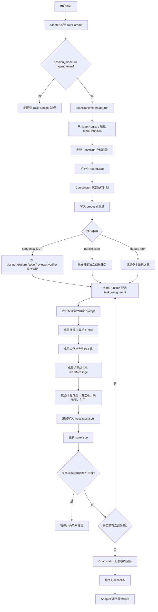

# Agent Team 模式设计

`agent_team` 是 Bamboo 的结构化多 Agent 编排模式。它不应该成为一套与现有系统平行的新框架，而应该复用 Bamboo 已有的 `TaskRuntime`、`subagent`、`skill`、`workflow`、`memory` 和 `BKN` 能力。

第一版实现要刻意收敛：由 coordinator 控制消息传递，使用 append-only 审计日志，维护共享 Team State，并先支持顺序执行策略。MVP 不支持成员 Agent 之间自由直聊，因为那会让调试、恢复和上下文裁剪都变得困难。

## 目标

- 增加用户可选的 `agent_team` 会话模式。
- 让 Bamboo 能把一个任务拆给多个角色化 Agent 执行。
- 让所有跨 Agent 通信可审计、可恢复。
- 让 Team 复用现有 subagent 和 skill。
- 按 Team 成员角色控制工具权限。
- 支持从持久化 Team Run 状态恢复或调试。

## 非目标

- 不做不受控的 swarm。
- 不允许 Agent 直接写入另一个 Agent 的隐藏上下文。
- 不绕过现有工具权限和审批规则。
- 不替代现有 `chat` 或 `project` 模式。
- 不把 skill 的专用逻辑复制到 team 定义里。

## 核心概念

### Team Definition

Team 是一个 YAML 定义文件，描述 coordinator、成员、执行策略、共享上下文、权限和停止策略。

示例：

```yaml
schema_version: 1
name: software-dev
description: Plan, implement, review, and verify software changes.

coordinator:
  agent: bamboo-core
  strategy: sequential

members:
  - role: planner
    subagent: planner
    required: true
  - role: explorer
    subagent: explorer
    required: false
  - role: coder
    agent: bamboo-core
    required: true
  - role: reviewer
    subagent: reviewer
    required: true
  - role: verifier
    subagent: verifier
    required: true

shared_context:
  memory: true
  bkn: true
  files: true
  task_state: true

policy:
  max_rounds: 6
  require_verification: true
  stop_on_user_approval: true
```

### Team Message

Agent 之间不要直接改写彼此的聊天历史。成员 Agent 只通过 `TeamRuntime` 发送结构化消息。

MVP 先支持这些消息类型：

- `task_assignment`：任务分配。
- `finding`：调研发现。
- `proposal`：方案或计划。
- `artifact`：产物，例如 patch 摘要、文件引用、报告。
- `review_comment`：评审意见。
- `verification_result`：验证结果。
- `blocker`：阻塞问题。

消息结构建议：

```json
{
  "id": "msg_...",
  "run_id": "run_...",
  "team": "software-dev",
  "from": "coordinator",
  "to": ["coder"],
  "type": "task_assignment",
  "summary": "实现已选方案。",
  "content": "根据 accepted plan 修改代码并更新测试。",
  "context_refs": [
    {"kind": "message", "id": "msg_plan"},
    {"kind": "file", "path": "bamboo/teams/runtime.py"}
  ],
  "requires_ack": true,
  "status": "pending",
  "created_at": "2026-08-02T00:00:00Z"
}
```

### Team State

Message 是事件流，Team State 是当前稳定事实表，用于恢复、压缩上下文和最终汇总。

```json
{
  "goal": "...",
  "status": "running",
  "current_phase": "review",
  "plan": [],
  "assignments": [],
  "findings": [],
  "decisions": [],
  "artifacts": [],
  "blockers": [],
  "verification": []
}
```

### 存储布局

使用 append-only JSONL 保存审计事件，用 JSON 保存当前状态。

```text
~/.bamboo/storage/team_runs/<run_id>/
  run.json
  state.json
  messages.jsonl
  artifacts/
    artifact_<id>.json
    notes/
```

## 执行流程



## 消息投递规则

- MVP 只允许 `coordinator -> member` 和 `member -> coordinator`。
- MVP 不支持 `member -> member` 直连。
- 每条消息都必须追加写入 `messages.jsonl`。
- 每条会改变事实状态的消息都必须反映到 `state.json`。
- `TeamRuntime` 负责校验 sender、recipient、message type 和 context refs。
- 传给成员的上下文应该是摘要加 `context_refs`，不要复制完整历史。
- coordinator 决定成员结果是成为 decision、blocker、新 assignment，还是 final output。

## Prompt 规则

Team 模式第一版不需要新建一整套 prompt 体系。建议复用现有 project/chat system prompt，再追加 team 专用 section。

成员 prompt 至少包含：

- 当前 team 名称和执行策略。
- 当前成员角色。
- 允许使用的工具和权限。
- 本轮 task assignment。
- 相关 Team State 摘要。
- 必须返回的 message type 和 schema。

建议新增 prompt 片段：

```text
bamboo/prompts/shared/36-agent-team.md
```

## 内置 Team

### `software-dev`

用途：代码修改、Bug 修复、测试、代码评审和验证。

默认流程：

```text
planner -> coder -> reviewer -> coder(optional) -> verifier -> coordinator
```

### `research`

用途：多来源调研和综合分析。

默认流程：

```text
planner -> explorer/github-reach/paper-reach/platform-reach -> reviewer -> coordinator
```

## 里程碑计划

| 里程碑 | 优先级 | 功能说明 | 新增文件 | 修改文件 | 验收方式 |
| --- | --- | --- | --- | --- | --- |
| M1: 数据模型和存储 | P0 | 定义 team run、member、message、artifact、state 模型。增加 `messages.jsonl` append-only 写入和 `state.json` 原子写入。 | `bamboo/teams/__init__.py`, `bamboo/teams/models.py`, `bamboo/teams/store.py`, `tests/test_team_store.py` | 如果包发现需要显式配置，修改 `pyproject.toml` | 单测能创建 run、追加 message、更新 state，并在进程重启后重新加载。 |
| M2: Team Registry | P0 | 加载包内和用户空间 team YAML，校验 schema，列出 active teams，支持内置和用户覆盖。 | `bamboo/teams/registry.py`, `bamboo/teams/buildin/software-dev.yaml`, `bamboo/teams/buildin/research.yaml`, `tests/test_team_registry.py` | `bamboo/userspace/userspace.py` 增加 `buildin_teams` 复制；如需集中启用配置，增加 `bamboo/configs/teams_buildin.yaml` | 测试内置 team 可加载、用户 team 可加载、disabled team 被跳过、`bamboo init` 不覆盖用户修改。 |
| M3: 顺序执行 TeamRuntime MVP | P0 | 实现 coordinator 控制的 sequential 执行。只支持 `coordinator -> member` 和 `member -> coordinator`。优先复用现有 subagent 执行能力。 | `bamboo/teams/runtime.py`, `bamboo/teams/coordinator.py`, `tests/test_team_runtime.py` | `bamboo/runtime/task_runtime.py` 或 session factory 接入点；如需结构化返回，修改 `bamboo/tools/buildin/subagent_run.py` | fake team 测试：planner 产出 proposal，coder 产出 artifact，verifier 产出 verification，最终 state 为 complete。 |
| M4: Session Mode 和 CLI/API 接入 | P0 | 在 `RunParams`、CLI 和 adapters 中暴露 `agent_team`，允许用户选择 team 名称。 | `tests/test_agent_team_session_mode.py` | `bamboo/helpers/constant.py`, `bamboo/helpers/requests_params.py`, `bamboo/run.py`, adapter 请求解析文件；如 UI 枚举写死，也要修改 UI model | `bamboo run --session-mode agent_team --team software-dev "..."` 能创建 team run 并返回最终结果。 |
| M5: Prompt 集成 | P1 | 增加 team 专用 prompt section 和成员角色 prompt builder。要求成员返回结构化 message。 | `bamboo/prompts/shared/36-agent-team.md`, `bamboo/teams/prompt.py`, `tests/test_team_prompt.py` | 如果 team mode 需要独立 section 目录，修改 `bamboo/prompts/system_prompt.py`；否则复用 shared prompt 加载 | 测试成员 prompt 包含 role、assignment、state summary、allowed tools、message schema。 |
| M6: 权限策略 | P1 | 增加按 role 的工具权限和 message type 权限。在成员执行前和 message append 前强制校验。 | `bamboo/teams/policy.py`, `tests/test_team_policy.py` | 如果 team run 需要 scoped permission，修改现有工具权限 resolver 接入文件 | 测试 planner 不能编辑文件，reviewer 不能写 artifact，非法 message type 被拒绝。 |
| M7: Artifact 和 Context Reference | P1 | 将结构化产物独立存储，通过引用传递，不在 message 中塞长文本。支持 file/message/artifact refs。 | `bamboo/teams/artifacts.py`, `tests/test_team_artifacts.py` | `bamboo/teams/store.py`, `bamboo/teams/prompt.py` | 测试 artifact 写入/读取、非法路径拒绝、prompt 中包含紧凑 refs。 |
| M8: UI 和日志 | P2 | 在 fancy UI 中展示 team 阶段、成员状态、消息、阻塞、artifact 和最终验证结果。 | 根据现有前端结构新增 `bamboo/adapters/app_fancy/static/` 下的组件或状态文件 | app-fancy 后端事件流和前端状态文件 | 手动 UI 验证；如果当前前端测试支持，增加 smoke/snapshot 测试。 |
| M9: 并行 Research 策略 | P2 | 为独立调研成员增加 parallel fan-out，再由 coordinator 汇总。适合 GitHub/paper/platform reach 任务。 | `bamboo/teams/strategies.py`, `tests/test_team_parallel_strategy.py` | `bamboo/teams/runtime.py` | 测试多个 fake member 独立运行，所有 findings 被持久化，coordinator 收到压缩摘要。 |
| M10: Debate 策略 | P3 | 为架构决策或方案选择增加多 proposal 策略，由 coordinator 对比并记录 decision。 | `tests/test_team_debate_strategy.py` | `bamboo/teams/strategies.py`, `bamboo/teams/coordinator.py` | 测试冲突 proposal 会形成带 rationale 的 decision。 |
| M11: 恢复和续跑 | P1 | 从 `state.json` 和 `messages.jsonl` 恢复中断的 team run，识别未完成阶段并继续或报告 blocker。 | `tests/test_team_resume.py` | `bamboo/teams/runtime.py`, `bamboo/teams/store.py`, CLI/API 入口 | 测试在 artifact message 后模拟崩溃，resume 后从 reviewer/verifier 阶段继续。 |
| M12: 正式文档 | P1 | 文档化 team YAML schema、runtime 行为、存储布局、CLI 用法和安全模型。 | `docs/agent-team.md` | 如 adapter 行为变化，修改 `docs/adapters.md` | 文档能说明如何创建 team、运行 team、查看日志、恢复 run。 |

## 推荐实现顺序

1. M1: 数据模型和存储
2. M2: Team Registry
3. M3: 顺序执行 TeamRuntime MVP
4. M4: Session Mode 和 CLI/API 接入
5. M5: Prompt 集成
6. M6: 权限策略
7. M7: Artifact 和 Context Reference
8. M11: 恢复和续跑
9. M12: 正式文档
10. M8: UI 和日志
11. M9: 并行 Research 策略
12. M10: Debate 策略

## MVP 验收标准

MVP 完成时，Bamboo 应该能做到：

1. 从内置 team YAML 加载 `software-dev`。
2. 使用 `session_mode=agent_team` 启动 run。
3. 持久化 `run.json`、`state.json` 和 `messages.jsonl`。
4. 执行 planner -> coder -> reviewer -> verifier 的顺序流程。
5. 强制执行 role-level 工具权限。
6. 从 storage 检查或恢复 run。
7. coordinator 基于 Team State 和 artifacts 生成最终回答。

## 待定设计问题

- `agent_team` 应该是新的 `SessionMode`，还是 `project` 模式下的 `--team software-dev` 选项？
- coordinator 是否永远使用 Bamboo Core，还是允许 team YAML 指定 coordinator subagent？
- 现有 `subagent_run` 能复用到什么程度，什么时候需要专用 member runtime？
- team run 是否共享普通任务 memory，还是只在完成后写一条蒸馏后的 memory？
- 第一版 UI 展示完整 message log，还是只展示阶段摘要？
